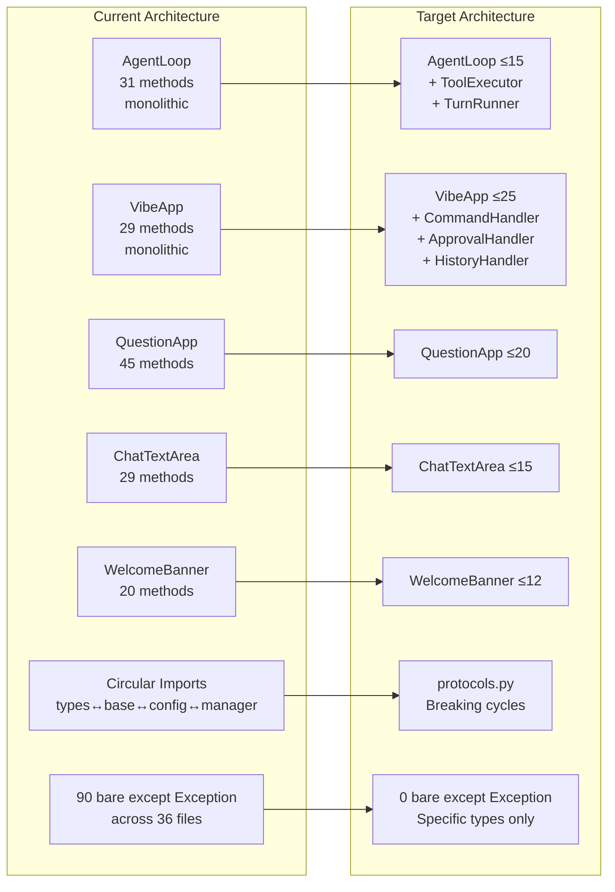
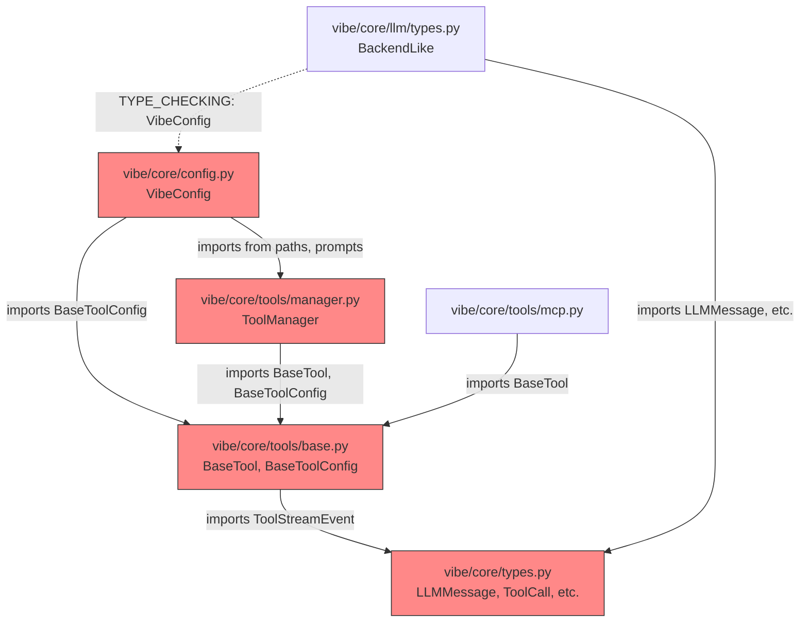
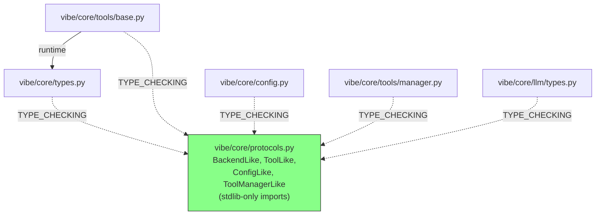
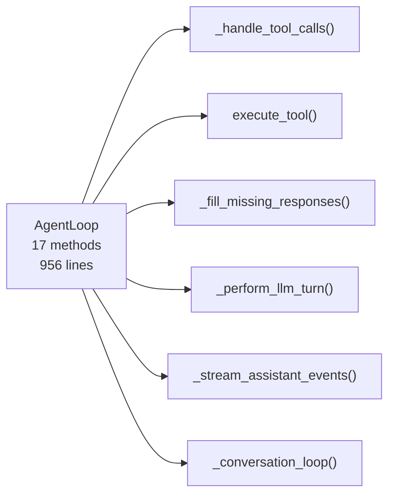
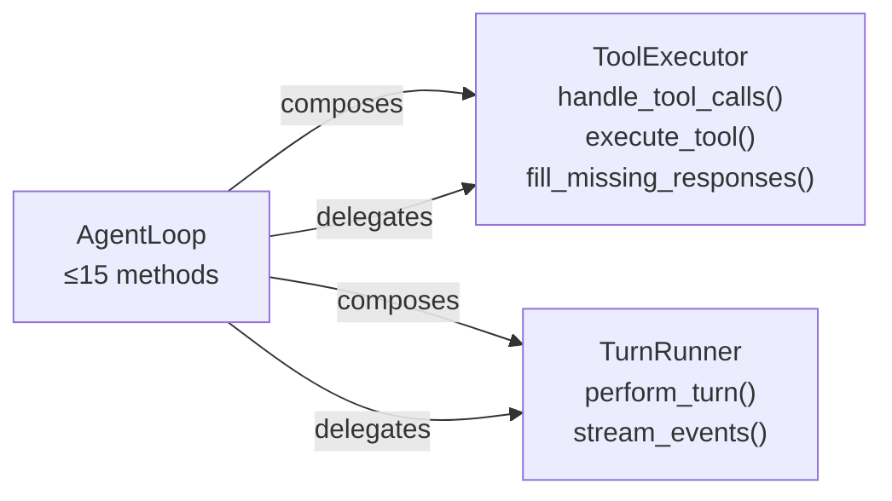

# Technical Specification

# 0. Agent Action Plan

## 0.1 Intent Clarification

### 0.1.1 Core Refactoring Objective

Based on the prompt, the Blitzy platform understands that the refactoring objective is to perform a **structural decomposition, circular dependency resolution, and exception-safety hardening** of the production `vibe/` Python package — the Blitzy Agent CLI codebase — without altering any runtime behavior, public APIs, or configuration schemas.

- **Refactoring type:** Code structure decomposition + Design pattern application (Composition over Inheritance) + Exception-safety hardening + Dead code removal + Complexity reduction
- **Target repository:** Same repository — all changes occur in-place within the existing `vibe/` package namespace
- **Codebase scope:** 126 Python source files, ~19,445 lines of code, organized across `vibe/core/`, `vibe/cli/`, `vibe/acp/`, and `vibe/setup/`

The refactoring addresses five concrete structural problems identified through static analysis:

| Problem Category | Count | Primary Locations |
|---|---|---|
| God classes (classes with excessive method counts) | 5 production classes | `app.py`, `agent_loop.py`, `question_app.py`, `text_area.py`, `welcome.py` |
| Circular import cycles | 12 cycles | Rooted in `types.py ↔ tools/base.py ↔ config.py ↔ tools/manager.py` |
| Bare `except Exception` blocks in production code | 90 instances across 36 files | Concentrated in `vibe/acp/`, `vibe/core/`, `vibe/cli/textual_ui/` |
| Deep nesting violations (≥5 levels) | 3 instances | `app.py:565`, `agent_loop.py:737`, `test_acp.py:303` |
| Dead code | 1 instance | `vibe/core/tools/base.py:128` (unreachable `yield` after `raise`) |

The implicit requirements surfaced by this specification are:

- All public API contracts must remain **binary-compatible** — callers of `AgentLoop.act()`, `BaseTool.invoke()`, `VibeConfig` fields, `VibeApp.__init__()`, and `VibeAcpAgentLoop` protocol messages experience zero changes
- Extracted methods must use **verbatim move + thin delegation** — no logic rewrites during extraction
- All composition must use **`__init__` injection** — no mixins, no subclass inheritance from extracted handlers
- The protocol module (`vibe/core/protocols.py`) must be **import-pure** — zero internal `vibe.*` runtime imports
- All `vibe/core/tools/builtins/prompts/*.md` files are immutable
- `pyproject.toml` entry points (`[project.scripts]`) are immutable
- No new dependencies may be added to `pyproject.toml`

### 0.1.2 Technical Interpretation

This refactoring translates to the following technical transformation strategy:

**Architecture Mapping — Current State → Target State:**



**Transformation Rules:**

- **God Class Decomposition:** Extract cohesive method groups into standalone handler classes composed via `__init__` injection. Original class retains one-liner delegation methods that forward to the injected handler.
- **Circular Import Resolution:** Introduce `vibe/core/protocols.py` containing `typing.Protocol` subclasses (`BackendLike`, `ToolLike`, `ConfigLike`, `ToolManagerLike`) that break the `types.py ↔ tools/base.py ↔ config.py ↔ tools/manager.py` cycle. Modules reference protocols instead of concrete implementations at type-annotation time.
- **Exception Narrowing:** Replace each `except Exception` with the narrowest applicable exception type(s) from the mapping provided — `OSError`, `FileNotFoundError`, `httpx.HTTPError`, `asyncio.CancelledError`, `pydantic.ValidationError`, `json.JSONDecodeError`, `ConnectionError`, `subprocess.SubprocessError`, `tomllib.TOMLDecodeError`, `ImportError`, `PermissionError` — selected per-module based on the actual operations performed.
- **Dead Code Removal:** Remove the unreachable `yield` statement at `vibe/core/tools/base.py:128` following the `raise NotImplementedError`.
- **Deep Nesting Resolution:** Extract inner logic into named helper methods or use early-return guard clauses to reduce nesting depth below 5 levels at `app.py:565`, `agent_loop.py:737`.

**Execution Batching (Sequential, Single Phase):**

The user specifies 4 sequential batches as a logical ordering for correctness dependencies. The Blitzy platform will execute the entire refactor in **one phase** but will respect the logical dependency ordering within that phase: circular import resolution first, then AgentLoop decomposition, then VibeApp decomposition, then remaining god classes + exception narrowing + cleanup.


## 0.2 Source Analysis

### 0.2.1 Comprehensive Source File Discovery

The following source files have been identified through systematic repository inspection as requiring refactoring. Every file is listed explicitly — nothing is deferred or pending.

**God Class Files (5 classes requiring decomposition):**

| File | Class | Current Methods | Target Methods | Lines | Action |
|---|---|---|---|---|---|
| `vibe/core/agent_loop.py` | `AgentLoop` | 17 | ≤15 | 956 | Extract `ToolExecutor` and `TurnRunner` |
| `vibe/cli/textual_ui/app.py` | `VibeApp` | 29 | ≤25 | 1,215 | Extract `CommandHandler`, `ApprovalHandler`, `HistoryHandler` |
| `vibe/cli/textual_ui/widgets/question_app.py` | `QuestionApp` | 45 | ≤20 | 479 | Extract helper classes for selection logic |
| `vibe/cli/textual_ui/widgets/chat_input/text_area.py` | `ChatTextArea` | 29 | ≤15 | 358 | Extract completion and history navigation logic |
| `vibe/cli/textual_ui/widgets/welcome.py` | `WelcomeBanner` | 20 | ≤12 | 283 | Extract animation and metadata rendering logic |

**Circular Import Chain Files (core cycle):**

| File | Lines | Role in Cycle | Key Imports |
|---|---|---|---|
| `vibe/core/types.py` | 393 | Defines core data contracts (`LLMMessage`, `ToolCall`, etc.) | No internal `vibe.*` imports |
| `vibe/core/tools/base.py` | 336 | Defines `BaseTool`, `BaseToolConfig`, `InvokeContext` | Imports `ToolStreamEvent` from `types.py` |
| `vibe/core/config.py` | 605 | Defines `VibeConfig`, nested config models | Imports `BaseToolConfig` from `tools/base.py` |
| `vibe/core/tools/manager.py` | 341 | Defines `ToolManager` discovery and caching | Imports `BaseTool`, `BaseToolConfig` from `tools/base.py` |
| `vibe/core/tools/mcp.py` | 358 | MCP proxy tool generation | Imports from `tools/base.py` |
| `vibe/core/tools/ui.py` | 68 | Tool UI display models | Defines `ToolUIData` Protocol |
| `vibe/core/llm/types.py` | 120 | Defines `BackendLike` Protocol | Imports from `vibe/core/types.py`, TYPE_CHECKING `config.py` |

**Bare `except Exception` Files (36 files, 90 instances in production code):**

| Module Pattern | Files | Instance Count |
|---|---|---|
| `vibe/acp/acp_agent_loop.py` | 1 | 2 |
| `vibe/acp/entrypoint.py` | 1 | 2 |
| `vibe/acp/tools/base.py` | 1 | 1 |
| `vibe/acp/tools/builtins/*.py` | 4 (bash, read_file, search_replace, write_file) | 7 |
| `vibe/cli/textual_ui/app.py` | 1 | 19 |
| `vibe/cli/textual_ui/widgets/chat_input/container.py` | 1 | 1 |
| `vibe/cli/textual_ui/widgets/welcome.py` | 1 | 1 |
| `vibe/cli/cli.py` | 1 | 3 |
| `vibe/cli/entrypoint.py` | 1 | 1 |
| `vibe/cli/clipboard.py` | 1 | 1 |
| `vibe/cli/terminal_setup.py` | 1 | 4 |
| `vibe/cli/autocompletion/path_completion.py` | 1 | 1 |
| `vibe/cli/update_notifier/adapters/pypi_update_gateway.py` | 1 | 2 |
| `vibe/core/agent_loop.py` | 1 | 4 |
| `vibe/core/config.py` | 1 | 1 |
| `vibe/core/utils.py` | 1 | 2 |
| `vibe/core/system_prompt.py` | 1 | 3 |
| `vibe/core/agents/manager.py` | 1 | 1 |
| `vibe/core/skills/manager.py` | 1 | 1 |
| `vibe/core/session/session_loader.py` | 1 | 1 |
| `vibe/core/session/session_logger.py` | 1 | 5 |
| `vibe/core/session/session_migration.py` | 1 | 1 |
| `vibe/core/llm/exceptions.py` | 1 | 1 |
| `vibe/core/autocompletion/file_indexer/ignore_rules.py` | 1 | 1 |
| `vibe/core/autocompletion/file_indexer/indexer.py` | 1 | 2 |
| `vibe/core/autocompletion/file_indexer/watcher.py` | 1 | 1 |
| `vibe/core/tools/builtins/bash.py` | 1 | 1 |
| `vibe/core/tools/builtins/grep.py` | 1 | 1 |
| `vibe/core/tools/builtins/search_replace.py` | 1 | 3 |
| `vibe/core/tools/builtins/task.py` | 1 | 1 |
| `vibe/core/tools/builtins/write_file.py` | 1 | 1 |
| `vibe/core/tools/manager.py` | 1 | 6 |
| `vibe/core/tools/mcp.py` | 1 | 4 |

**Deep Nesting Violation Files:**

| File | Location | Complexity Score |
|---|---|---|
| `vibe/cli/textual_ui/app.py` | `_handle_agent_loop_turn` (~line 565) | C901 = 11 |
| `vibe/cli/textual_ui/app.py` | `action_interrupt` (~line 882) | C901 = 11 |
| `vibe/core/agent_loop.py` | `_stream_assistant_events` (~line 369) | C901 = 11 |
| `vibe/core/agent_loop.py` | `_handle_tool_calls` (~line 428) | C901 = 11 |

**Dead Code File:**

| File | Location | Description |
|---|---|---|
| `vibe/core/tools/base.py` | Line 128 | Unreachable `yield` statement after `raise NotImplementedError` in abstract `run()` method |

### 0.2.2 Current Structure Mapping

```
Current vibe/ Structure (126 Python files, ~19,445 lines):
vibe/
├── __init__.py
├── whats_new.md
├── acp/
│   ├── __init__.py
│   ├── acp_agent_loop.py          (550 lines — 2 bare excepts)
│   ├── entrypoint.py              (81 lines — 2 bare excepts)
│   ├── utils.py
│   └── tools/
│       ├── __init__.py
│       ├── base.py                (100 lines — 1 bare except)
│       ├── session_update.py
│       └── builtins/
│           ├── bash.py            (134 lines — 3 bare excepts)
│           ├── read_file.py       (54 lines — 1 bare except)
│           ├── search_replace.py  (129 lines — 2 bare excepts)
│           ├── todo.py            (65 lines — 0 bare excepts)
│           └── write_file.py      (98 lines — 1 bare except)
├── cli/
│   ├── __init__.py
│   ├── cli.py                     (3 bare excepts)
│   ├── clipboard.py               (1 bare except)
│   ├── commands.py
│   ├── entrypoint.py              (1 bare except)
│   ├── history_manager.py
│   ├── terminal_setup.py          (4 bare excepts)
│   ├── autocompletion/
│   │   ├── __init__.py
│   │   ├── base.py
│   │   ├── path_completion.py     (1 bare except)
│   │   └── slash_command.py
│   ├── plan_offer/
│   │   ├── adapters/http_whoami_gateway.py
│   │   ├── decide_plan_offer.py
│   │   └── ports/whoami_gateway.py
│   ├── textual_ui/
│   │   ├── __init__.py
│   │   ├── app.py                 (1215 lines — GOD CLASS: 29 methods, 19 bare excepts)
│   │   ├── external_editor.py
│   │   ├── terminal_theme.py
│   │   ├── handlers/
│   │   │   ├── __init__.py
│   │   │   └── event_handler.py   (164 lines)
│   │   └── widgets/
│   │       ├── __init__.py
│   │       ├── agent_indicator.py
│   │       ├── approval_app.py
│   │       ├── compact.py
│   │       ├── config_app.py
│   │       ├── context_progress.py
│   │       ├── loading.py
│   │       ├── messages.py
│   │       ├── no_markup_static.py
│   │       ├── path_display.py
│   │       ├── question_app.py    (479 lines — GOD CLASS: 45 methods)
│   │       ├── spinner.py
│   │       ├── status_message.py
│   │       ├── tool_widgets.py
│   │       ├── tools.py
│   │       ├── utils.py
│   │       ├── welcome.py         (283 lines — GOD CLASS: 20 methods, 1 bare except)
│   │       └── chat_input/
│   │           ├── __init__.py
│   │           ├── body.py
│   │           ├── completion_manager.py
│   │           ├── completion_popup.py
│   │           ├── container.py   (1 bare except)
│   │           └── text_area.py   (358 lines — GOD CLASS: 29 methods)
│   └── update_notifier/
│       ├── __init__.py
│       ├── update.py
│       ├── whats_new.py
│       ├── adapters/
│       │   ├── filesystem_update_cache_repository.py
│       │   ├── github_update_gateway.py
│       │   └── pypi_update_gateway.py  (2 bare excepts)
│       └── ports/
│           ├── update_cache_repository.py
│           └── update_gateway.py
├── core/
│   ├── __init__.py
│   ├── agent_loop.py              (956 lines — GOD CLASS: 17 methods, 4 bare excepts)
│   ├── config.py                  (605 lines — 1 bare except, circular import participant)
│   ├── middleware.py
│   ├── output_formatters.py
│   ├── programmatic.py
│   ├── system_prompt.py           (3 bare excepts)
│   ├── trusted_folders.py
│   ├── types.py                   (393 lines — circular import participant)
│   ├── utils.py                   (2 bare excepts)
│   ├── agents/
│   │   ├── __init__.py
│   │   ├── manager.py             (1 bare except)
│   │   └── models.py
│   ├── autocompletion/
│   │   ├── __init__.py
│   │   ├── completers.py
│   │   ├── fuzzy.py
│   │   ├── path_prompt.py
│   │   ├── path_prompt_adapter.py
│   │   └── file_indexer/
│   │       ├── __init__.py
│   │       ├── ignore_rules.py    (1 bare except)
│   │       ├── indexer.py         (2 bare excepts)
│   │       ├── store.py
│   │       └── watcher.py         (1 bare except)
│   ├── llm/
│   │   ├── __init__.py
│   │   ├── exceptions.py          (1 bare except)
│   │   ├── format.py
│   │   ├── types.py               (120 lines — defines BackendLike Protocol)
│   │   └── backend/
│   │       ├── __init__.py
│   │       ├── factory.py
│   │       ├── generic.py
│   │       └── mistral.py
│   ├── paths/
│   │   ├── __init__.py
│   │   ├── config_paths.py
│   │   └── global_paths.py
│   ├── prompts/
│   │   └── __init__.py
│   ├── session/
│   │   ├── session_loader.py      (1 bare except)
│   │   ├── session_logger.py      (5 bare excepts)
│   │   └── session_migration.py   (1 bare except)
│   ├── skills/
│   │   ├── __init__.py
│   │   ├── manager.py             (1 bare except)
│   │   ├── models.py
│   │   └── parser.py
│   └── tools/
│       ├── base.py                (336 lines — circular import, dead code at :128)
│       ├── manager.py             (341 lines — circular import, 6 bare excepts)
│       ├── mcp.py                 (358 lines — 4 bare excepts)
│       ├── ui.py                  (68 lines)
│       └── builtins/
│           ├── ask_user_question.py
│           ├── bash.py            (1 bare except)
│           ├── grep.py            (1 bare except)
│           ├── read_file.py
│           ├── search_replace.py  (3 bare excepts)
│           ├── task.py            (1 bare except)
│           ├── todo.py
│           ├── write_file.py      (1 bare except)
│           └── prompts/ (IMMUTABLE — 9 .md files)
└── setup/
    ├── onboarding/
    │   ├── __init__.py
    │   ├── base.py
    │   └── screens/
    │       ├── __init__.py
    │       ├── api_key.py
    │       ├── theme_selection.py
    │       └── welcome.py
    └── trusted_folders/
        └── trust_folder_dialog.py
```


## 0.3 Scope Boundaries

### 0.3.1 Exhaustively In Scope

**Source Transformations — God Class Decomposition:**
- `vibe/core/agent_loop.py` — Extract `ToolExecutor` and `TurnRunner`; reduce to ≤15 methods
- `vibe/cli/textual_ui/app.py` — Extract `CommandHandler`, `ApprovalHandler`, `HistoryHandler`; reduce to ≤25 methods
- `vibe/cli/textual_ui/widgets/question_app.py` — Decompose to ≤20 methods
- `vibe/cli/textual_ui/widgets/chat_input/text_area.py` — Decompose to ≤15 methods
- `vibe/cli/textual_ui/widgets/welcome.py` — Decompose to ≤12 methods

**Source Transformations — Circular Import Resolution:**
- `vibe/core/types.py` — Update to reference protocols where needed
- `vibe/core/tools/base.py` — Replace concrete type references with protocol references; remove dead code at line 128
- `vibe/core/config.py` — Break circular chain by using protocol types at annotation level
- `vibe/core/tools/manager.py` — Use protocol types to decouple from direct imports
- `vibe/core/tools/mcp.py` — Update import chain dependencies
- `vibe/core/tools/ui.py` — Align with protocol-first architecture
- `vibe/core/llm/types.py` — `BackendLike` protocol already exists here; verify alignment

**Source Transformations — New Module Creation:**
- `vibe/core/protocols.py` — New: shared Protocol classes (`BackendLike`, `ToolLike`, `ConfigLike`, `ToolManagerLike`)
- `vibe/core/tool_executor.py` — New: extracted from AgentLoop
- `vibe/core/turn_runner.py` — New: extracted from AgentLoop
- `vibe/cli/textual_ui/handlers/__init__.py` — Update: add exports for new handler modules
- `vibe/cli/textual_ui/handlers/command_handler.py` — New: extracted from VibeApp
- `vibe/cli/textual_ui/handlers/approval_handler.py` — New: extracted from VibeApp
- `vibe/cli/textual_ui/handlers/history_handler.py` — New: extracted from VibeApp

**Source Transformations — Exception Narrowing (36 files, 90 instances):**
- `vibe/acp/acp_agent_loop.py` — 2 instances → `httpx.HTTPError`, `asyncio.CancelledError`, `json.JSONDecodeError`, `ConnectionError`
- `vibe/acp/entrypoint.py` — 2 instances → `OSError`, `tomllib.TOMLDecodeError`, `ImportError`
- `vibe/acp/tools/base.py` — 1 instance → `OSError`, `pydantic.ValidationError`
- `vibe/acp/tools/builtins/bash.py` — 3 instances → `OSError`, `FileNotFoundError`, `asyncio.CancelledError`
- `vibe/acp/tools/builtins/read_file.py` — 1 instance → `OSError`, `FileNotFoundError`, `asyncio.CancelledError`
- `vibe/acp/tools/builtins/search_replace.py` — 2 instances → `OSError`, `FileNotFoundError`, `asyncio.CancelledError`
- `vibe/acp/tools/builtins/write_file.py` — 1 instance → `OSError`, `FileNotFoundError`, `asyncio.CancelledError`
- `vibe/cli/textual_ui/app.py` — 19 instances → `OSError`, `subprocess.SubprocessError`, `asyncio.CancelledError`
- `vibe/cli/textual_ui/widgets/chat_input/container.py` — 1 instance → `OSError`
- `vibe/cli/textual_ui/widgets/welcome.py` — 1 instance → `OSError`
- `vibe/cli/cli.py` — 3 instances → `OSError`, `KeyboardInterrupt`
- `vibe/cli/entrypoint.py` — 1 instance → `OSError`
- `vibe/cli/clipboard.py` — 1 instance → `OSError`, `subprocess.SubprocessError`
- `vibe/cli/terminal_setup.py` — 4 instances → `OSError`, `subprocess.SubprocessError`
- `vibe/cli/autocompletion/path_completion.py` — 1 instance → `OSError`
- `vibe/cli/update_notifier/adapters/pypi_update_gateway.py` — 2 instances → `httpx.HTTPError`, `json.JSONDecodeError`, `OSError`
- `vibe/core/agent_loop.py` — 4 instances → `httpx.HTTPError`, `asyncio.CancelledError`, `json.JSONDecodeError`
- `vibe/core/config.py` — 1 instance → `OSError`, `pydantic.ValidationError`
- `vibe/core/utils.py` — 2 instances → `OSError`, `asyncio.CancelledError`
- `vibe/core/system_prompt.py` — 3 instances → `OSError`, `subprocess.SubprocessError`
- `vibe/core/agents/manager.py` — 1 instance → `OSError`, `ImportError`
- `vibe/core/skills/manager.py` — 1 instance → `OSError`, `ImportError`
- `vibe/core/session/session_loader.py` — 1 instance → `OSError`, `json.JSONDecodeError`
- `vibe/core/session/session_logger.py` — 5 instances → `OSError`, `json.JSONDecodeError`, `PermissionError`
- `vibe/core/session/session_migration.py` — 1 instance → `OSError`, `json.JSONDecodeError`
- `vibe/core/llm/exceptions.py` — 1 instance → `httpx.HTTPError`
- `vibe/core/autocompletion/file_indexer/ignore_rules.py` — 1 instance → `OSError`
- `vibe/core/autocompletion/file_indexer/indexer.py` — 2 instances → `OSError`
- `vibe/core/autocompletion/file_indexer/watcher.py` — 1 instance → `OSError`
- `vibe/core/tools/builtins/bash.py` — 1 instance → `OSError`, `subprocess.SubprocessError`
- `vibe/core/tools/builtins/grep.py` — 1 instance → `OSError`, `subprocess.SubprocessError`
- `vibe/core/tools/builtins/search_replace.py` — 3 instances → `OSError`, `pydantic.ValidationError`
- `vibe/core/tools/builtins/task.py` — 1 instance → `OSError`, `asyncio.CancelledError`
- `vibe/core/tools/builtins/write_file.py` — 1 instance → `OSError`, `PermissionError`
- `vibe/core/tools/manager.py` — 6 instances → `OSError`, `ImportError`, `pydantic.ValidationError`
- `vibe/core/tools/mcp.py` — 4 instances → `httpx.HTTPError`, `OSError`, `asyncio.CancelledError`

**Test Updates (import path corrections only):**
- `tests/**/*.py` — 102 test files; any importing from refactored modules need path updates
- Files importing `AgentLoop`: 21 test files
- Files importing `VibeApp`: 9 test files
- Files importing from `vibe.core.types`: 30 test files
- Files importing from `vibe.core.tools.base`: 20 test files
- Files importing from `vibe.core.config`: 34 test files

**Configuration Updates:**
- `pyproject.toml` — No changes permitted (R10: no new dependencies)

**Documentation Updates:**
- `README.md` — Update if structural changes affect documented paths
- `AGENTS.md` — Verify coding standards alignment
- `CONTRIBUTING.md` — Update if module references change

**Deep Nesting Resolution:**
- `vibe/cli/textual_ui/app.py:565` — `_handle_agent_loop_turn` (C901 = 11)
- `vibe/cli/textual_ui/app.py:882` — `action_interrupt` (C901 = 11)
- `vibe/core/agent_loop.py:369` — `_stream_assistant_events` (C901 = 11)
- `vibe/core/agent_loop.py:428` — `_handle_tool_calls` (C901 = 11)

**Cognitive Complexity Reduction (15 current C901 violations):**
- All 15 functions flagged by `ruff check --select C901 vibe/` must have complexity ≤ baseline count

### 0.3.2 Explicitly Out of Scope

- **Behavioral changes** — No runtime logic modifications during extraction; code is moved verbatim
- **Feature additions** — No new features, capabilities, or integrations
- **Public API modifications** — `AgentLoop.act()`, `BaseTool.invoke()`, `VibeConfig` fields, `VibeApp.__init__()`, `VibeAcpAgentLoop` protocol messages remain unchanged
- **Configuration schema changes** — TOML schema, environment variable names, and dotenv format are immutable
- **Dependency changes** — `pyproject.toml` `[project.dependencies]` and `[project.optional-dependencies]` must not be modified
- **Prompt file changes** — All `vibe/core/tools/builtins/prompts/*.md` files are immutable
- **Entry point changes** — `pyproject.toml` `[project.scripts]` section is immutable
- **Test logic changes** — Test files are updated only for import path corrections, not for logic changes
- **`FakeClient` (16 methods)** and **`TestTrustedFoldersManager` (18 methods)** — These are in `tests/` directory (test-only), not production code
- **`vibe/setup/`** — No refactoring targets identified in this module
- **New suppression annotations** — `# noqa`, `# type: ignore`, `# pragma: no cover` additions are prohibited (R8)


## 0.4 Target Design

### 0.4.1 Refactored Structure Planning

The target architecture preserves the existing `vibe/` package namespace while introducing 7 new Python modules and modifying 36+ existing files. All new modules use composition over inheritance and export their public API via `__all__`.

```
Target vibe/ Structure (additions and modifications highlighted):
vibe/
├── __init__.py
├── whats_new.md
├── acp/
│   ├── __init__.py
│   ├── acp_agent_loop.py          [MODIFIED — exception narrowing]
│   ├── entrypoint.py              [MODIFIED — exception narrowing]
│   ├── utils.py
│   └── tools/
│       ├── __init__.py
│       ├── base.py                [MODIFIED — exception narrowing]
│       ├── session_update.py
│       └── builtins/
│           ├── bash.py            [MODIFIED — exception narrowing]
│           ├── read_file.py       [MODIFIED — exception narrowing]
│           ├── search_replace.py  [MODIFIED — exception narrowing]
│           ├── todo.py
│           └── write_file.py      [MODIFIED — exception narrowing]
├── cli/
│   ├── __init__.py
│   ├── cli.py                     [MODIFIED — exception narrowing]
│   ├── clipboard.py               [MODIFIED — exception narrowing]
│   ├── commands.py
│   ├── entrypoint.py              [MODIFIED — exception narrowing]
│   ├── history_manager.py
│   ├── terminal_setup.py          [MODIFIED — exception narrowing]
│   ├── autocompletion/
│   │   ├── __init__.py
│   │   ├── base.py
│   │   ├── path_completion.py     [MODIFIED — exception narrowing]
│   │   └── slash_command.py
│   ├── plan_offer/ (unchanged)
│   ├── textual_ui/
│   │   ├── __init__.py
│   │   ├── app.py                 [MODIFIED — decomposed ≤25 methods, exception narrowing]
│   │   ├── external_editor.py
│   │   ├── terminal_theme.py
│   │   ├── handlers/
│   │   │   ├── __init__.py        [MODIFIED — re-exports new handler modules]
│   │   │   ├── event_handler.py
│   │   │   ├── command_handler.py     [NEW — slash command dispatch from VibeApp]
│   │   │   ├── approval_handler.py    [NEW — tool approval flow from VibeApp]
│   │   │   └── history_handler.py     [NEW — session history rebuild from VibeApp]
│   │   └── widgets/
│   │       ├── question_app.py    [MODIFIED — decomposed ≤20 methods]
│   │       ├── welcome.py         [MODIFIED — decomposed ≤12 methods, exception narrowing]
│   │       └── chat_input/
│   │           ├── container.py   [MODIFIED — exception narrowing]
│   │           └── text_area.py   [MODIFIED — decomposed ≤15 methods]
│   └── update_notifier/
│       └── adapters/
│           └── pypi_update_gateway.py  [MODIFIED — exception narrowing]
├── core/
│   ├── __init__.py
│   ├── protocols.py               [NEW — Protocol classes breaking circular imports]
│   ├── agent_loop.py              [MODIFIED — decomposed ≤15 methods, exception narrowing]
│   ├── tool_executor.py           [NEW — tool call handling from AgentLoop]
│   ├── turn_runner.py             [NEW — LLM turn orchestration from AgentLoop]
│   ├── config.py                  [MODIFIED — circular import resolution, exception narrowing]
│   ├── middleware.py
│   ├── output_formatters.py
│   ├── programmatic.py
│   ├── system_prompt.py           [MODIFIED — exception narrowing]
│   ├── trusted_folders.py
│   ├── types.py                   [MODIFIED — circular import resolution]
│   ├── utils.py                   [MODIFIED — exception narrowing]
│   ├── agents/
│   │   └── manager.py             [MODIFIED — exception narrowing]
│   ├── autocompletion/
│   │   └── file_indexer/
│   │       ├── ignore_rules.py    [MODIFIED — exception narrowing]
│   │       ├── indexer.py         [MODIFIED — exception narrowing]
│   │       └── watcher.py         [MODIFIED — exception narrowing]
│   ├── llm/
│   │   ├── exceptions.py          [MODIFIED — exception narrowing]
│   │   └── types.py               [MODIFIED — align with protocols.py]
│   ├── session/
│   │   ├── session_loader.py      [MODIFIED — exception narrowing]
│   │   ├── session_logger.py      [MODIFIED — exception narrowing]
│   │   └── session_migration.py   [MODIFIED — exception narrowing]
│   └── tools/
│       ├── base.py                [MODIFIED — circular import resolution, dead code removal]
│       ├── manager.py             [MODIFIED — circular import resolution, exception narrowing]
│       ├── mcp.py                 [MODIFIED — exception narrowing]
│       └── builtins/
│           ├── bash.py            [MODIFIED — exception narrowing]
│           ├── grep.py            [MODIFIED — exception narrowing]
│           ├── search_replace.py  [MODIFIED — exception narrowing]
│           ├── task.py            [MODIFIED — exception narrowing]
│           └── write_file.py      [MODIFIED — exception narrowing]
└── setup/ (unchanged)
```

### 0.4.2 Design Pattern Applications

**Composition over Inheritance (R2):**

All extracted handlers are injected into parent classes via `__init__` constructor. The parent class retains thin one-liner delegation methods that forward calls to the composed handler.

```python
# Pattern: VibeApp composes CommandHandler

self._command_handler = CommandHandler(self)
```

**Protocol Module Pattern (R3):**

`vibe/core/protocols.py` contains only `typing.Protocol` subclasses and `typing.TypeAlias` definitions with zero internal `vibe.*` runtime imports. This breaks the circular dependency chain by providing type-only contracts.

```python
class ToolLike(Protocol):
    def get_name(self) -> str: ...
```

**Extraction Pattern (R1):**

Methods are moved verbatim into new modules. The original class retains a one-liner delegation stub:

```python
# In VibeApp (after extraction):

def handle_command(self, cmd: str) -> None:
    self._command_handler.handle_command(cmd)
```

**Explicit Public API (R6):**

Every new `.py` file exports its public API via `__all__`:

```python
__all__ = ["ToolExecutor"]
```

### 0.4.3 New Module Specifications

| Module | Purpose | Public API (`__all__`) | Composed Into |
|---|---|---|---|
| `vibe/core/protocols.py` | Protocol classes breaking circular imports | `BackendLike`, `ToolLike`, `ConfigLike`, `ToolManagerLike` | Referenced by `types.py`, `base.py`, `config.py`, `manager.py` |
| `vibe/core/tool_executor.py` | Tool call handling extracted from AgentLoop | `ToolExecutor` with `handle_tool_calls()`, `execute_tool()`, `fill_missing_responses()` | `AgentLoop.__init__()` |
| `vibe/core/turn_runner.py` | Single LLM turn orchestration from AgentLoop | `TurnRunner` with `perform_turn()`, `stream_events()` | `AgentLoop.__init__()` |
| `vibe/cli/textual_ui/handlers/command_handler.py` | Slash command dispatch from VibeApp | `CommandHandler` with `handle_command()` | `VibeApp.__init__()` |
| `vibe/cli/textual_ui/handlers/approval_handler.py` | Tool approval flow from VibeApp | `ApprovalHandler` with `on_approval_granted()`, `on_approval_rejected()` | `VibeApp.__init__()` |
| `vibe/cli/textual_ui/handlers/history_handler.py` | Session history rebuild from VibeApp | `HistoryHandler` with `rebuild_history()` | `VibeApp.__init__()` |

### 0.4.4 Architectural Diagrams — Before and After

**Before — Circular Import Chain:**



**After — Protocol-Based Decoupling:**



**Before — AgentLoop Monolith:**



**After — AgentLoop Decomposed:**




## 0.5 Transformation Mapping

### 0.5.1 File-by-File Transformation Plan

The complete file transformation map covers every file in scope. The entire refactor executes in **one phase** — no split across multiple phases.

**Batch 1 — Circular Import Resolution + Protocol Creation:**

| Target File | Transformation | Source File | Key Changes |
|---|---|---|---|
| `vibe/core/protocols.py` | CREATE | `vibe/core/llm/types.py` | New module: `BackendLike`, `ToolLike`, `ConfigLike`, `ToolManagerLike` Protocol classes; stdlib-only imports; `__all__` export; `from __future__ import annotations` |
| `vibe/core/types.py` | UPDATE | `vibe/core/types.py` | Update TYPE_CHECKING imports to reference protocols.py where needed; maintain all existing exports |
| `vibe/core/tools/base.py` | UPDATE | `vibe/core/tools/base.py` | Replace concrete cross-module type references with Protocol references under TYPE_CHECKING; remove dead code at line 128 (unreachable `yield` after `raise NotImplementedError`) |
| `vibe/core/config.py` | UPDATE | `vibe/core/config.py` | Break circular import by using Protocol-based type annotations under TYPE_CHECKING for tool-related types |
| `vibe/core/tools/manager.py` | UPDATE | `vibe/core/tools/manager.py` | Use Protocol-based references where needed to break cycle |
| `vibe/core/tools/mcp.py` | UPDATE | `vibe/core/tools/mcp.py` | Update import chain to work with protocol-decoupled architecture |
| `vibe/core/tools/ui.py` | UPDATE | `vibe/core/tools/ui.py` | Verify alignment with protocol-first architecture |
| `vibe/core/llm/types.py` | UPDATE | `vibe/core/llm/types.py` | `BackendLike` remains here but is also re-exported from protocols.py; update TYPE_CHECKING references |

**Batch 2 — AgentLoop Decomposition:**

| Target File | Transformation | Source File | Key Changes |
|---|---|---|---|
| `vibe/core/tool_executor.py` | CREATE | `vibe/core/agent_loop.py` | Extract `ToolExecutor` class with `handle_tool_calls()`, `execute_tool()`, `fill_missing_responses()`; verbatim method move; `__all__` export; `from __future__ import annotations` |
| `vibe/core/turn_runner.py` | CREATE | `vibe/core/agent_loop.py` | Extract `TurnRunner` class with `perform_turn()`, `stream_events()`; verbatim method move; `__all__` export; `from __future__ import annotations` |
| `vibe/core/agent_loop.py` | UPDATE | `vibe/core/agent_loop.py` | Replace extracted methods with thin delegation one-liners; compose `ToolExecutor` and `TurnRunner` via `__init__`; preserve `act()` signature and return type; reduce to ≤15 methods |

**Batch 3 — VibeApp Decomposition:**

| Target File | Transformation | Source File | Key Changes |
|---|---|---|---|
| `vibe/cli/textual_ui/handlers/command_handler.py` | CREATE | `vibe/cli/textual_ui/app.py` | Extract `CommandHandler` with `handle_command()`; verbatim method move; `__all__` export; `from __future__ import annotations` |
| `vibe/cli/textual_ui/handlers/approval_handler.py` | CREATE | `vibe/cli/textual_ui/app.py` | Extract `ApprovalHandler` with `on_approval_granted()`, `on_approval_rejected()`; verbatim method move; `__all__` export; `from __future__ import annotations` |
| `vibe/cli/textual_ui/handlers/history_handler.py` | CREATE | `vibe/cli/textual_ui/app.py` | Extract `HistoryHandler` with `rebuild_history()`; verbatim method move; `__all__` export; `from __future__ import annotations` |
| `vibe/cli/textual_ui/handlers/__init__.py` | UPDATE | `vibe/cli/textual_ui/handlers/__init__.py` | Add re-exports for `CommandHandler`, `ApprovalHandler`, `HistoryHandler` |
| `vibe/cli/textual_ui/app.py` | UPDATE | `vibe/cli/textual_ui/app.py` | Replace extracted methods with thin delegation one-liners; compose handlers via `__init__`; preserve `VibeApp.__init__()` constructor signature; reduce to ≤25 methods |

**Batch 4 — Remaining God Classes + Exception Narrowing + Cleanup:**

| Target File | Transformation | Source File | Key Changes |
|---|---|---|---|
| `vibe/cli/textual_ui/widgets/question_app.py` | UPDATE | `vibe/cli/textual_ui/widgets/question_app.py` | Decompose QuestionApp from 45 to ≤20 methods via helper class extraction |
| `vibe/cli/textual_ui/widgets/chat_input/text_area.py` | UPDATE | `vibe/cli/textual_ui/widgets/chat_input/text_area.py` | Decompose ChatTextArea from 29 to ≤15 methods via helper class extraction |
| `vibe/cli/textual_ui/widgets/welcome.py` | UPDATE | `vibe/cli/textual_ui/widgets/welcome.py` | Decompose WelcomeBanner from 20 to ≤12 methods via helper class extraction |
| `vibe/acp/acp_agent_loop.py` | UPDATE | `vibe/acp/acp_agent_loop.py` | Replace 2 `except Exception` with `httpx.HTTPError`, `asyncio.CancelledError`, `json.JSONDecodeError`, `ConnectionError` |
| `vibe/acp/entrypoint.py` | UPDATE | `vibe/acp/entrypoint.py` | Replace 2 `except Exception` with `OSError`, `tomllib.TOMLDecodeError`, `ImportError` |
| `vibe/acp/tools/base.py` | UPDATE | `vibe/acp/tools/base.py` | Replace 1 `except Exception` with specific types |
| `vibe/acp/tools/builtins/bash.py` | UPDATE | `vibe/acp/tools/builtins/bash.py` | Replace 3 `except Exception` with `OSError`, `FileNotFoundError`, `asyncio.CancelledError`, `pydantic.ValidationError` |
| `vibe/acp/tools/builtins/read_file.py` | UPDATE | `vibe/acp/tools/builtins/read_file.py` | Replace 1 `except Exception` with specific types per ACP builtin mapping |
| `vibe/acp/tools/builtins/search_replace.py` | UPDATE | `vibe/acp/tools/builtins/search_replace.py` | Replace 2 `except Exception` with specific types per ACP builtin mapping |
| `vibe/acp/tools/builtins/write_file.py` | UPDATE | `vibe/acp/tools/builtins/write_file.py` | Replace 1 `except Exception` with specific types per ACP builtin mapping |
| `vibe/cli/cli.py` | UPDATE | `vibe/cli/cli.py` | Replace 3 `except Exception` with specific types |
| `vibe/cli/clipboard.py` | UPDATE | `vibe/cli/clipboard.py` | Replace 1 `except Exception` with `OSError`, `subprocess.SubprocessError` |
| `vibe/cli/entrypoint.py` | UPDATE | `vibe/cli/entrypoint.py` | Replace 1 `except Exception` with specific types |
| `vibe/cli/terminal_setup.py` | UPDATE | `vibe/cli/terminal_setup.py` | Replace 4 `except Exception` with `OSError`, `subprocess.SubprocessError` |
| `vibe/cli/autocompletion/path_completion.py` | UPDATE | `vibe/cli/autocompletion/path_completion.py` | Replace 1 `except Exception` with `OSError` |
| `vibe/cli/update_notifier/adapters/pypi_update_gateway.py` | UPDATE | `vibe/cli/update_notifier/adapters/pypi_update_gateway.py` | Replace 2 `except Exception` with `httpx.HTTPError`, `json.JSONDecodeError`, `OSError` |
| `vibe/cli/textual_ui/app.py` | UPDATE | `vibe/cli/textual_ui/app.py` | Replace 19 `except Exception` with `OSError`, `subprocess.SubprocessError`, `asyncio.CancelledError` |
| `vibe/cli/textual_ui/widgets/chat_input/container.py` | UPDATE | `vibe/cli/textual_ui/widgets/chat_input/container.py` | Replace 1 `except Exception` with specific types |
| `vibe/cli/textual_ui/widgets/welcome.py` | UPDATE | `vibe/cli/textual_ui/widgets/welcome.py` | Replace 1 `except Exception` with specific types |
| `vibe/core/agent_loop.py` | UPDATE | `vibe/core/agent_loop.py` | Replace 4 `except Exception` with `httpx.HTTPError`, `asyncio.CancelledError`, `json.JSONDecodeError` |
| `vibe/core/config.py` | UPDATE | `vibe/core/config.py` | Replace 1 `except Exception` with specific types |
| `vibe/core/utils.py` | UPDATE | `vibe/core/utils.py` | Replace 2 `except Exception` with specific types |
| `vibe/core/system_prompt.py` | UPDATE | `vibe/core/system_prompt.py` | Replace 3 `except Exception` with `OSError`, `subprocess.SubprocessError` |
| `vibe/core/agents/manager.py` | UPDATE | `vibe/core/agents/manager.py` | Replace 1 `except Exception` with `OSError`, `ImportError` |
| `vibe/core/skills/manager.py` | UPDATE | `vibe/core/skills/manager.py` | Replace 1 `except Exception` with `OSError`, `ImportError` |
| `vibe/core/session/session_loader.py` | UPDATE | `vibe/core/session/session_loader.py` | Replace 1 `except Exception` with `OSError`, `json.JSONDecodeError` |
| `vibe/core/session/session_logger.py` | UPDATE | `vibe/core/session/session_logger.py` | Replace 5 `except Exception` with `OSError`, `json.JSONDecodeError`, `PermissionError` |
| `vibe/core/session/session_migration.py` | UPDATE | `vibe/core/session/session_migration.py` | Replace 1 `except Exception` with `OSError`, `json.JSONDecodeError` |
| `vibe/core/llm/exceptions.py` | UPDATE | `vibe/core/llm/exceptions.py` | Replace 1 `except Exception` with `httpx.HTTPError` |
| `vibe/core/autocompletion/file_indexer/ignore_rules.py` | UPDATE | `vibe/core/autocompletion/file_indexer/ignore_rules.py` | Replace 1 `except Exception` with `OSError` |
| `vibe/core/autocompletion/file_indexer/indexer.py` | UPDATE | `vibe/core/autocompletion/file_indexer/indexer.py` | Replace 2 `except Exception` with `OSError` |
| `vibe/core/autocompletion/file_indexer/watcher.py` | UPDATE | `vibe/core/autocompletion/file_indexer/watcher.py` | Replace 1 `except Exception` with `OSError` |
| `vibe/core/tools/builtins/bash.py` | UPDATE | `vibe/core/tools/builtins/bash.py` | Replace 1 `except Exception` with `OSError`, `subprocess.SubprocessError` |
| `vibe/core/tools/builtins/grep.py` | UPDATE | `vibe/core/tools/builtins/grep.py` | Replace 1 `except Exception` with `OSError`, `subprocess.SubprocessError` |
| `vibe/core/tools/builtins/search_replace.py` | UPDATE | `vibe/core/tools/builtins/search_replace.py` | Replace 3 `except Exception` with `OSError`, `pydantic.ValidationError` |
| `vibe/core/tools/builtins/task.py` | UPDATE | `vibe/core/tools/builtins/task.py` | Replace 1 `except Exception` with `OSError`, `asyncio.CancelledError` |
| `vibe/core/tools/builtins/write_file.py` | UPDATE | `vibe/core/tools/builtins/write_file.py` | Replace 1 `except Exception` with `OSError`, `PermissionError` |
| `vibe/core/tools/manager.py` | UPDATE | `vibe/core/tools/manager.py` | Replace 6 `except Exception` with `OSError`, `ImportError`, `pydantic.ValidationError` |
| `vibe/core/tools/mcp.py` | UPDATE | `vibe/core/tools/mcp.py` | Replace 4 `except Exception` with `httpx.HTTPError`, `OSError`, `asyncio.CancelledError` |

### 0.5.2 Cross-File Dependencies

**Import Statement Updates for New Modules:**

| Old Import | New Import | Affected Files |
|---|---|---|
| Methods inline in `AgentLoop` | `from vibe.core.tool_executor import ToolExecutor` | `vibe/core/agent_loop.py` |
| Methods inline in `AgentLoop` | `from vibe.core.turn_runner import TurnRunner` | `vibe/core/agent_loop.py` |
| Methods inline in `VibeApp` | `from vibe.cli.textual_ui.handlers.command_handler import CommandHandler` | `vibe/cli/textual_ui/app.py` |
| Methods inline in `VibeApp` | `from vibe.cli.textual_ui.handlers.approval_handler import ApprovalHandler` | `vibe/cli/textual_ui/app.py` |
| Methods inline in `VibeApp` | `from vibe.cli.textual_ui.handlers.history_handler import HistoryHandler` | `vibe/cli/textual_ui/app.py` |
| N/A (new Protocol module) | `from vibe.core.protocols import BackendLike, ToolLike, ConfigLike, ToolManagerLike` | `vibe/core/types.py`, `vibe/core/tools/base.py`, `vibe/core/config.py`, `vibe/core/tools/manager.py` (under TYPE_CHECKING) |

**Test File Import Corrections:**

Tests that import `AgentLoop` (21 files), `VibeApp` (9 files), and other refactored modules will continue to import from their original locations. The public import paths (`from vibe.core.agent_loop import AgentLoop`, `from vibe.cli.textual_ui.app import VibeApp`) remain stable. Test updates are needed **only** if tests directly reference internal methods that have been moved to new modules.

**Configuration Updates:**

No configuration files require changes. The `pyproject.toml` entry points remain:
- `blitzy = "vibe.cli.entrypoint:main"`
- `blitzy-acp = "vibe.acp.entrypoint:main"`

### 0.5.3 Wildcard Patterns

All wildcard patterns use trailing patterns only:

- `vibe/acp/tools/builtins/*.py` — ACP builtin tool exception narrowing (R9: sibling-pattern application)
- `vibe/core/session/*.py` — Session module exception narrowing
- `vibe/core/tools/builtins/*.py` — Core builtin tool exception narrowing
- `vibe/core/autocompletion/file_indexer/*.py` — File indexer exception narrowing
- `vibe/cli/textual_ui/handlers/*.py` — New and updated handler modules
- `tests/**/*.py` — Test files potentially needing import path updates


## 0.6 Dependency Inventory

### 0.6.1 Key Private and Public Packages

Per Rule R10, **no new dependencies may be added** to `pyproject.toml`. All packages listed below are already installed and verified. The exception narrowing work references exception types from these existing dependencies.

**Runtime Dependencies (from `pyproject.toml` `[project.dependencies]`):**

| Package | Registry | Constraint | Installed Version | Relevance to Refactor |
|---|---|---|---|---|
| `pydantic` | PyPI | `>=2.12.4` | 2.12.5 | `pydantic.ValidationError` used in exception narrowing |
| `pydantic-settings` | PyPI | `>=2.12.0` | 2.12.0 | Config model validation |
| `httpx` | PyPI | `>=0.28.1` | 0.28.1 | `httpx.HTTPError` used in exception narrowing |
| `textual` | PyPI | `>=1.0.0` | 6.9.0 | UI framework for god class decomposition targets |
| `rich` | PyPI | `>=14.0.0` | 14.2.0 | Terminal rendering |
| `anyio` | PyPI | `>=4.12.0` | 4.12.0 | Async I/O abstraction |
| `mistralai` | PyPI | `==1.9.11` | 1.9.11 | Pinned exactly; no changes |
| `agent-client-protocol` | PyPI | `==0.7.1` | 0.7.1 | ACP layer; pinned exactly |
| `mcp` | PyPI | `>=1.14.0` | 1.23.0 | MCP tool integration |
| `pexpect` | PyPI | `>=4.9.0` | 4.9.0 | Bash tool process control |
| `pyyaml` | PyPI | `>=6.0.0` | 6.0.3 | Skills YAML parsing |
| `python-dotenv` | PyPI | `>=1.0.0` | 1.2.1 | Environment loading |
| `tomli-w` | PyPI | `>=1.2.0` | 1.2.0 | TOML writing; `tomllib.TOMLDecodeError` for exception narrowing |
| `packaging` | PyPI | `>=24.1` | 25.0 | Version parsing |
| `watchfiles` | PyPI | `>=1.1.1` | 1.1.1 | File system monitoring |
| `pyperclip` | PyPI | `>=1.11.0` | 1.11.0 | Clipboard operations |
| `textual-speedups` | PyPI | `>=0.2.1` | 0.2.1 | Rendering performance |
| `tree-sitter` | PyPI | `>=0.25.2` | 0.25.2 | Shell parsing |
| `tree-sitter-bash` | PyPI | `>=0.25.1` | 0.25.1 | Bash grammar |

**Dev Dependencies (from `pyproject.toml` `[dependency-groups] dev`):**

| Package | Registry | Constraint | Installed Version | Relevance to Refactor |
|---|---|---|---|---|
| `pytest` | PyPI | `>=8.3.5` | 8.4.2 | Test execution for validation gates |
| `pytest-asyncio` | PyPI | `>=1.2.0` | 1.3.0 | Async test support |
| `pytest-timeout` | PyPI | `>=2.4.0` | 2.4.0 | Test timeout enforcement |
| `pytest-xdist` | PyPI | `>=3.8.0` | 3.8.0 | Parallel test execution |
| `ruff` | PyPI | `>=0.14.5` | 0.14.7 | Linting and C901 complexity checks |
| `pyright` | PyPI | `>=1.1.403` | 1.1.407 | Static type checking |
| `vulture` | PyPI | `>=2.14` | 2.14 | Dead code detection |
| `respx` | PyPI | `>=0.22.0` | 0.22.0 | HTTP mocking for tests |

**Standard Library Modules Used in Exception Narrowing (no installation needed):**

| Module | Exception Type | Usage Context |
|---|---|---|
| `asyncio` | `asyncio.CancelledError` | ACP agent loop, core agent loop, tool execution |
| `json` | `json.JSONDecodeError` | ACP agent loop, session files, update notifier |
| `subprocess` | `subprocess.SubprocessError` | CLI terminal setup, clipboard, system prompt |
| `tomllib` | `tomllib.TOMLDecodeError` | ACP entrypoint config parsing |
| `builtins` | `OSError`, `FileNotFoundError`, `PermissionError`, `ImportError` | File operations across all modules |

### 0.6.2 Import Refactoring

**Files Requiring Import Updates (by wildcard pattern):**

- `vibe/core/agent_loop.py` — Add imports for `ToolExecutor`, `TurnRunner`
- `vibe/cli/textual_ui/app.py` — Add imports for `CommandHandler`, `ApprovalHandler`, `HistoryHandler`
- `vibe/core/types.py` — Add TYPE_CHECKING import for protocols
- `vibe/core/tools/base.py` — Add TYPE_CHECKING import for protocols
- `vibe/core/config.py` — Add TYPE_CHECKING import for protocols
- `vibe/core/tools/manager.py` — Add TYPE_CHECKING import for protocols
- `vibe/cli/textual_ui/handlers/__init__.py` — Add re-exports for new handler classes

**Exception-Related Import Additions (per module pattern):**

| Module Pattern | New Imports Required |
|---|---|
| `vibe/acp/tools/builtins/*.py` | `import asyncio`, `from pydantic import ValidationError` (where not already imported) |
| `vibe/acp/acp_agent_loop.py` | `import json`, `import asyncio` (where not already imported) |
| `vibe/acp/entrypoint.py` | `import tomllib` |
| `vibe/core/agent_loop.py` | `import json`, `import asyncio` (where not already imported) |
| `vibe/core/session/*.py` | `import json` (where not already imported) |
| `vibe/cli/textual_ui/app.py` | `import subprocess`, `import asyncio` (where not already imported) |
| `vibe/cli/update_notifier/*.py` | `import json` (where not already imported) |

### 0.6.3 External Reference Updates

**Build Files:**
- `pyproject.toml` — **No changes** (R10: no dependency modifications)

**CI/CD Files:**
- `.github/workflows/*.yml` — No changes required; workflows run `uv run pytest` and `uv run ruff check` which will validate the refactored code

**Documentation:**
- `README.md` — Review for structural path references
- `CONTRIBUTING.md` — Review for module reference accuracy
- `AGENTS.md` — Already aligned with Python 3.12 conventions; no updates needed


## 0.7 Special Analysis

### 0.7.1 Circular Import Cycle — Detailed Resolution Strategy

The circular import chain in `vibe/core/` is the foundational prerequisite (Batch 1) because all subsequent decomposition work depends on clean import resolution.

**Current Import Topology:**

The cycle operates across four primary modules with TYPE_CHECKING guards already partially mitigating runtime failures:

| Module | Runtime Imports from `vibe.*` | TYPE_CHECKING Imports |
|---|---|---|
| `vibe/core/types.py` | None | `from vibe.core.tools.base import BaseTool` (with `else: BaseTool = Any` fallback) |
| `vibe/core/tools/base.py` | `from vibe.core.types import ToolStreamEvent` | `from vibe.core.agents.manager import AgentManager`; `from vibe.core.types import ApprovalCallback, UserInputCallback` |
| `vibe/core/config.py` | `from vibe.core.tools.base import BaseToolConfig` (line 30, top-level runtime import) | None for tools |
| `vibe/core/tools/manager.py` | `from vibe.core.tools.base import BaseTool, BaseToolConfig` | `from vibe.core.config import MCPHttp, MCPStdio, MCPStreamableHttp, VibeConfig` |
| `vibe/core/llm/types.py` | `from vibe.core.types import AvailableTool, LLMChunk, LLMMessage, StrToolChoice` | `from vibe.core.config import ModelConfig` |

**Critical Cycle Path:** `config.py` → (runtime imports) `tools/base.py:BaseToolConfig` → `types.py:ToolStreamEvent` → (TYPE_CHECKING) `tools/base.py:BaseTool`. The cycle is partially broken by the `TYPE_CHECKING` + `else: BaseTool = Any` pattern in `types.py`, but this workaround introduces a runtime type erasure that undermines type safety.

**Resolution via `vibe/core/protocols.py`:**

The new protocol module will contain:

- `ToolLike(Protocol)` — abstracts `BaseTool.get_name()`, `BaseTool.invoke()`, `BaseTool.get_permission()` contracts
- `ConfigLike(Protocol)` — abstracts `VibeConfig` field access needed by cross-module consumers
- `ToolManagerLike(Protocol)` — abstracts `ToolManager.get()`, `ToolManager.available_tools` contracts
- `BackendLike` — re-exported from `vibe/core/llm/types.py` for centralized protocol access (the existing Protocol definition in `llm/types.py` is retained as the source of truth)

**Protocol Module Purity (R3):** `vibe/core/protocols.py` must import only from `typing`, `collections.abc`, and other stdlib modules. The verification command `grep "^from vibe\." vibe/core/protocols.py | grep -v "__future__"` must return empty.

**Migration Strategy for `config.py`:** The top-level runtime import `from vibe.core.tools.base import BaseToolConfig` at line 30 is the hardest cycle link to break. The approach is:
- Move `BaseToolConfig` to be importable via `TYPE_CHECKING` guard
- At runtime, use a lightweight `dict`-based validation or a local copy of the minimal `BaseToolConfig` Pydantic model if the field type is needed for Pydantic schema construction
- Alternatively, restructure so `BaseToolConfig` is defined in a separate leaf module that both `config.py` and `base.py` can import without cycles

### 0.7.2 Cognitive Complexity Analysis

The current codebase has **15 C901 violations** reported by `ruff check --select C901 vibe/`. The refactoring must achieve a count ≤ this baseline after completion. Key violations and resolution strategies:

| Function | File | Current Score | Resolution Strategy |
|---|---|---|---|
| `apply_changes` | `vibe/core/autocompletion/file_indexer/store.py` | 14 | Extract inner branch logic into named helper methods |
| `check_allowlist_denylist` | `vibe/core/tools/builtins/bash.py` | 14 | Extract platform-specific checks into separate methods |
| `get_git_status` | `vibe/core/system_prompt.py` | 13 | Extract subprocess calls into helper functions |
| `fetch_update` | `vibe/cli/update_notifier/adapters/github_update_gateway.py` | 13 | Break condition chain into early-return guard clauses |
| `_run_agent_loop` | `vibe/acp/acp_agent_loop.py` | 12 | Partially resolved by AgentLoop decomposition in Batch 2 |
| `_build_patterns` | `vibe/core/autocompletion/file_indexer/ignore_rules.py` | 12 | Extract pattern compilation into helper |
| `get_universal_system_prompt` | `vibe/core/system_prompt.py` | 12 | Extract subsections into dedicated builder methods |
| `__add__` | `vibe/core/types.py` | 12 | Simplify via early returns |
| `run` (task.py) | `vibe/core/tools/builtins/task.py` | 12 | Extract subagent setup logic |
| `_on_key` | `vibe/cli/textual_ui/widgets/chat_input/text_area.py` | 12 | Decomposed via ChatTextArea god class split |
| `_stream_assistant_events` | `vibe/core/agent_loop.py` | 11 | Extracted to TurnRunner in Batch 2 |
| `_handle_tool_calls` | `vibe/core/agent_loop.py` | 11 | Extracted to ToolExecutor in Batch 2 |
| `_handle_agent_loop_turn` | `vibe/cli/textual_ui/app.py` | 11 | Method remains in VibeApp but simplified via delegation |
| `action_interrupt` | `vibe/cli/textual_ui/app.py` | 11 | Simplified via guard clauses |
| `copy_selection_to_clipboard` | `vibe/cli/clipboard.py` | 11 | Extract fallback chain into named strategies |

### 0.7.3 Exception Narrowing — Sibling-Pattern Analysis (R9)

Rule R9 mandates that when narrowing an `except Exception` in one ACP tool wrapper, the identical pattern must be applied to **all** ACP tool wrappers. The ACP builtins share a consistent pattern:

**ACP Tool Wrapper Pattern (5 builtins):**

All ACP builtin tools in `vibe/acp/tools/builtins/` follow the same structural pattern:
- `_load_state()` → may raise `OSError`, `pydantic.ValidationError`
- `_send_in_progress_session_update()` → may raise `httpx.HTTPError`, `asyncio.CancelledError`
- `client.create_terminal()` / `client.read_text_file()` / `client.write_text_file()` — ACP RPC calls → may raise `ConnectionError`, `httpx.HTTPError`, `asyncio.CancelledError`
- File/process operations → may raise `OSError`, `FileNotFoundError`, `PermissionError`

| ACP Builtin | Exception Instances | Consistent Narrowed Types |
|---|---|---|
| `bash.py` | 3 | `OSError`, `FileNotFoundError`, `asyncio.CancelledError`, `pydantic.ValidationError` |
| `read_file.py` | 1 | `OSError`, `FileNotFoundError`, `asyncio.CancelledError`, `pydantic.ValidationError` |
| `search_replace.py` | 2 | `OSError`, `FileNotFoundError`, `asyncio.CancelledError`, `pydantic.ValidationError` |
| `todo.py` | 0 | N/A (no bare excepts) |
| `write_file.py` | 1 | `OSError`, `FileNotFoundError`, `asyncio.CancelledError`, `pydantic.ValidationError` |

The `vibe/acp/tools/base.py` base class (`_send_in_progress_session_update`) has 1 bare except that follows the same pattern and must be narrowed identically.

### 0.7.4 Validation Framework Baseline Measurements

The user specifies a comprehensive 7-gate validation framework. Pre-refactor baseline values measured from the current repository state:

| Metric | Command | Current Value |
|---|---|---|
| Python version | `python --version` | 3.12.3 |
| Import smoke test | `python -c "from vibe.core.agent_loop import AgentLoop; ..."` | OK |
| AgentLoop methods | `grep -c "    def " vibe/core/agent_loop.py` | 17 |
| VibeApp methods | `grep -c "    def " vibe/cli/textual_ui/app.py` | 29 |
| QuestionApp methods | `grep -c "    def " vibe/cli/textual_ui/widgets/question_app.py` | 45 |
| ChatTextArea methods | `grep -c "    def " vibe/cli/textual_ui/widgets/chat_input/text_area.py` | 29 |
| WelcomeBanner methods | `grep -c "    def " vibe/cli/textual_ui/widgets/welcome.py` | 20 |
| Bare exception count (prod) | `grep -rn "except Exception" vibe/ --include="*.py" \| grep -v tests/ \| wc -l` | 90 |
| Bare exception count (ACP) | `grep -rn "except Exception" vibe/acp/ --include="*.py" \| wc -l` | 12 |
| C901 violations | `uv run ruff check --select C901 vibe/` | 15 |
| Ruff version | `uv run ruff --version` | 0.14.7 |
| Pyright version | `uv run pyright --version` | 1.1.407 |
| Total Python files | `find vibe/ -name "*.py" \| wc -l` | 126 |
| Total lines of code | `find vibe/ -name "*.py" -exec cat {} + \| wc -l` | 19,445 |
| Test file count | `find tests/ -name "*.py" \| wc -l` | 102 |

### 0.7.5 Dead Code Removal Analysis

The single dead code instance at `vibe/core/tools/base.py:128` consists of an unreachable `yield` statement after a `raise NotImplementedError` in the abstract `run()` method:

```python
async def run(self, args, ctx=None):
    raise NotImplementedError  # pragma: no cover
    yield  # type: ignore[misc]  ← DEAD CODE
```

The `yield` exists to make `run()` a valid `AsyncGenerator` at the syntax level, but it is unreachable after the `raise`. The `# type: ignore[misc]` annotation also violates R8 if it were a new addition. Resolution: remove the `yield` line and restructure the abstract method signature to properly type as `AsyncGenerator` without requiring an unreachable `yield` statement, or use an `if False: yield` pattern that satisfies the generator requirement without dead code flags.


## 0.8 Refactoring Rules

### 0.8.1 User-Specified Refactoring Rules

The user has defined **10 explicit rules** that govern all refactoring activities. Each rule is captured verbatim with its verification command and scope:

| Rule | Name | Requirement | Verification Command | Scope |
|---|---|---|---|---|
| R1 | Extraction over rewrite | Refactored code MUST be extracted (move + delegate), not rewritten. Original logic preserved verbatim. | `git diff` of moved functions shows only import/self-reference changes, no logic edits | All god class decomposition |
| R2 | Composition over inheritance | Extracted handlers MUST be composed into parent classes via `__init__` injection, not mixin or inheritance | `grep` for no new `class X(ExtractedHandler)` relationships | VibeApp, AgentLoop, QuestionApp |
| R3 | Protocol module purity | `vibe/core/protocols.py` MUST contain only `typing.Protocol` subclasses, `typing.TypeAlias` definitions, and stdlib type imports | `grep "^from vibe\." vibe/core/protocols.py \| grep -v "__future__"` returns empty | Circular import resolution |
| R4 | Exception specificity | Each `except Exception` replacement MUST use the narrowest applicable type(s) from Section 3 mapping. Bare `except Exception` and `except BaseException` are PROHIBITED | `grep -rn "except Exception" vibe/ --include="*.py" \| grep -v tests/` returns empty | All `vibe/` files |
| R5 | One PR per god class | Each god class decomposition MUST be a separate pull request. No single PR modifies more than one god class | PR review scope validation | VibeApp, AgentLoop, QuestionApp, ChatTextArea, WelcomeBanner |
| R6 | Explicit public API | Every new `.py` file MUST export its public API via `__all__` | `grep -L "__all__" <new_files>` returns empty | All newly created modules |
| R7 | PEP 563 convention | `from __future__ import annotations` MUST remain in all `vibe/` files and be added to all new files | `grep -rL "from __future__ import annotations" vibe/ --include="*.py"` returns only `__init__.py` files | All `vibe/` files |
| R8 | No new suppressions | Refactoring MUST NOT introduce new `# noqa`, `# type: ignore`, or `# pragma: no cover` annotations | `git diff --unified=0 \| grep -c "noqa\|type: ignore"` returns 0 | All changed files |
| R9 | Sibling-pattern application | When narrowing an `except Exception` in one ACP tool wrapper, the same type narrowing MUST be applied to ALL ACP tool wrappers with the identical pattern | `grep -rn "except Exception" vibe/acp/ --include="*.py"` returns empty | All `vibe/acp/` files |
| R10 | No new dependencies | Refactoring MUST NOT add entries to `pyproject.toml` `[project.dependencies]` or `[project.optional-dependencies]` | `git diff pyproject.toml` shows no dependency changes | Entire refactor |

### 0.8.2 Immutable Preservation Constraints

The following elements are explicitly marked as immutable and must not be changed under any circumstances:

- **`AgentLoop.act()` signature and return type** — All callers (21 test files + 4 production modules) depend on this
- **`BaseTool` generic type parameters and `invoke()` contract** — 20+ tool implementations depend on this interface
- **`VibeConfig` field names and TOML schema** — Configuration precedence chain is load-bearing
- **`VibeApp.__init__()` constructor signature** — Test fixtures and CLI launcher depend on this
- **`VibeAcpAgentLoop` ACP protocol messages** — IDE integration contracts
- **`pyproject.toml` entry points (`[project.scripts]`):**
  - `blitzy = "vibe.cli.entrypoint:main"`
  - `blitzy-acp = "vibe.acp.entrypoint:main"`
- **All `vibe/core/tools/builtins/prompts/*.md` files** — 9 markdown prompt files are immutable

### 0.8.3 Special Instructions and Constraints

**Minimal Change Mandate:**
- Extracted methods MUST be moved verbatim — logic edits are PROHIBITED during extraction
- Import paths in dependent files updated to point to new locations
- Original class retains thin delegation methods (one-liners calling extracted handler)
- Test files updated ONLY for import path changes, not logic

**Batch Execution Ordering:**
The user specifies 4 logical batches with strict prerequisite dependencies. While the Blitzy platform executes in one phase, the internal ordering must respect:
- Batch 1 (circular import resolution) has no prerequisites
- Batch 2 (AgentLoop decomposition) depends on Batch 1
- Batch 3 (VibeApp decomposition) depends on Batch 1
- Batch 4 (remaining classes + exception narrowing + cleanup) depends on Batches 1–3

**Validation Gate Requirements:**
The user specifies 7 validation gates (V1–V7) with 17 final acceptance checks. Every gate must pass before proceeding. Key validation commands include:
- `uv run pytest -x --timeout=10` — Full test suite
- `uv run ruff check vibe/` — Linting
- `uv run pyright vibe/` — Type checking
- Import smoke tests for all key modules
- CLI smoke test via `blitzy --help`
- Method count verification via `grep -c "    def "` for each decomposed class

### 0.8.4 Implementation Rules from Project Standards

From `AGENTS.md` and `pyproject.toml` tool configuration, the following project-level rules apply to all refactoring:

- **Ruff configuration:** Line length 88, target `py312`, preview mode enabled
- **Ruff lint rules:** `F`, `I`, `D2`, `UP`, `TID`, `ANN`, `PLR`, `B0`, `B905`, `DOC102`, `RUF022`, `RUF010`, `RUF012`, `RUF019`, `RUF100`
- **Ruff isort:** `known-first-party = ["vibe"]`, `ban-relative-imports = "all"`, `required-imports = ["from __future__ import annotations"]`
- **Ruff pylint limits:** `max-statements=50`, `max-branches=15`, `max-locals=15`, `max-args=9`, `max-returns=6`, `max-nested-blocks=4`
- **Pyright:** `pythonVersion = "3.12"`, strict mode on `vibe/**/*.py` and `tests/**/*.py`
- **Pytest:** `-vvvv -q -n auto --durations=10 --import-mode=importlib`, timeout=10s

### 0.8.5 User-Specified Implementation Rules (Project-Level)

The user has provided 5 project-level implementation rules that apply to all deliverables:

- **Observability:** Ship observability with the initial implementation. Verify structured logging, correlation IDs, and health checks are present. Check existing logging in the codebase and fill gaps — the refactoring must not degrade existing logging in any module.
- **Onboarding & Continued Development:** Update `README.md`, `CONTRIBUTING.md`, and any setup guides to reflect structural changes. Include suggested next tasks discovered during refactoring.
- **Executive Presentation:** Deliver an executive summary as a `reveal.js` HTML artifact covering what was done, architectural changes, risks, and onboarding. Include Mermaid diagrams and visual elements on every slide.
- **Explainability:** Document all non-trivial decisions in a decision log (Markdown table). Include a bidirectional traceability matrix mapping source constructs to target implementations — 100% coverage, no gaps.
- **Visual Architecture Documentation:** All visual documentation uses Mermaid diagrams with descriptive titles and legends. Both before-state and after-state architectures must be shown for all modifications.


## 0.9 References

### 0.9.1 Codebase Files and Folders Searched

The following files and folders were systematically explored to derive all conclusions in this Agent Action Plan:

**Root-Level Configuration and Documentation:**

| File | Purpose | Key Findings |
|---|---|---|
| `pyproject.toml` | Package metadata, dependencies, tool config | Python ≥3.12, 19 runtime deps, 13 dev deps, ruff/pyright config, entry points |
| `README.md` | User-facing documentation | Installation and usage guide |
| `CONTRIBUTING.md` | Contributor guide | Local setup, testing, linting expectations |
| `AGENTS.md` | Python 3.12 coding standards | Modern idiom requirements, `uv` usage |
| `CHANGELOG.md` | Release history | Version tracking |

**Core Package Files Examined:**

| File / Folder | Lines | Exploration Depth | Key Findings |
|---|---|---|---|
| `vibe/__init__.py` | — | Read summary | Package root, `__version__ = "0.1.0"` |
| `vibe/core/agent_loop.py` | 956 | Full import analysis, method count | 17 methods, 4 bare excepts, C901 violations |
| `vibe/core/types.py` | 393 | Import chain analysis | `TYPE_CHECKING` guard for `BaseTool`, `else: BaseTool = Any` fallback |
| `vibe/core/tools/base.py` | 336 | Import chain, dead code analysis | Runtime import from `types.py`, dead code at line 128 |
| `vibe/core/config.py` | 605 | Import chain, `BaseToolConfig` usage analysis | Top-level runtime import of `BaseToolConfig`, deferred `ToolManager` import |
| `vibe/core/tools/manager.py` | 341 | Import chain analysis | `TYPE_CHECKING` guard for `VibeConfig`, 6 bare excepts |
| `vibe/core/tools/mcp.py` | 358 | Summary and exception analysis | 4 bare excepts, MCP proxy generation |
| `vibe/core/tools/ui.py` | 68 | Summary | `ToolUIData` Protocol definition |
| `vibe/core/llm/types.py` | 120 | Full file read | `BackendLike` Protocol definition, `TYPE_CHECKING` for `ModelConfig` |
| `vibe/core/middleware.py` | — | Summary | Middleware pipeline, `ConversationMiddleware` Protocol |
| `vibe/core/session/session_loader.py` | 157 | Exception analysis | 1 bare except |
| `vibe/core/session/session_logger.py` | 316 | Exception analysis | 5 bare excepts |
| `vibe/core/session/session_migration.py` | 41 | Exception analysis | 1 bare except |
| `vibe/core/system_prompt.py` | — | Exception analysis | 3 bare excepts |
| `vibe/core/utils.py` | — | Exception analysis | 2 bare excepts |
| `vibe/core/agents/manager.py` | — | Exception analysis | 1 bare except |
| `vibe/core/skills/manager.py` | — | Exception analysis | 1 bare except |
| `vibe/core/llm/exceptions.py` | 195 | Exception analysis | 1 bare except |
| `vibe/core/autocompletion/file_indexer/` | — | Exception analysis | 4 bare excepts across 3 files |
| `vibe/core/tools/builtins/` | — | Exception analysis | 7 bare excepts across 5 files |

**CLI Package Files Examined:**

| File / Folder | Lines | Exploration Depth | Key Findings |
|---|---|---|---|
| `vibe/cli/textual_ui/app.py` | 1,215 | Import analysis, method count, exception scan | 29 methods, 19 bare excepts, 2 C901 violations |
| `vibe/cli/textual_ui/handlers/__init__.py` | 5 | Full read | Re-exports `EventHandler` only |
| `vibe/cli/textual_ui/handlers/event_handler.py` | 164 | Summary | Existing event handler pattern |
| `vibe/cli/textual_ui/widgets/question_app.py` | 479 | Method count | 45 methods |
| `vibe/cli/textual_ui/widgets/chat_input/text_area.py` | 358 | Method count, C901 check | 29 methods, `_on_key` C901=12 |
| `vibe/cli/textual_ui/widgets/welcome.py` | 283 | Method count, exception scan | 20 methods, 1 bare except |
| `vibe/cli/textual_ui/widgets/chat_input/container.py` | — | Exception scan | 1 bare except |
| `vibe/cli/cli.py` | — | Exception scan | 3 bare excepts |
| `vibe/cli/entrypoint.py` | — | Exception scan | 1 bare except |
| `vibe/cli/clipboard.py` | — | Exception and C901 scan | 1 bare except, C901=11 |
| `vibe/cli/terminal_setup.py` | — | Exception scan | 4 bare excepts |
| `vibe/cli/autocompletion/path_completion.py` | — | Exception scan | 1 bare except |
| `vibe/cli/update_notifier/adapters/pypi_update_gateway.py` | 107 | Exception scan | 2 bare excepts |
| `vibe/cli/update_notifier/adapters/github_update_gateway.py` | 101 | C901 check | C901=13 |

**ACP Package Files Examined:**

| File / Folder | Lines | Exploration Depth | Key Findings |
|---|---|---|---|
| `vibe/acp/acp_agent_loop.py` | 550 | Exception scan, C901 check | 2 bare excepts, C901=12 |
| `vibe/acp/entrypoint.py` | 81 | Exception scan | 2 bare excepts |
| `vibe/acp/tools/base.py` | 100 | Exception scan | 1 bare except |
| `vibe/acp/tools/builtins/bash.py` | 134 | Exception scan | 3 bare excepts |
| `vibe/acp/tools/builtins/read_file.py` | 54 | Exception scan | 1 bare except |
| `vibe/acp/tools/builtins/search_replace.py` | 129 | Exception scan | 2 bare excepts |
| `vibe/acp/tools/builtins/todo.py` | 65 | Exception scan | 0 bare excepts |
| `vibe/acp/tools/builtins/write_file.py` | 98 | Exception scan | 1 bare except |

**Test Directory Examined:**

| Folder | Files | Exploration Depth | Key Findings |
|---|---|---|---|
| `tests/` (root) | 102 Python files | Directory listing, import grep analysis | 21 files import AgentLoop, 9 import VibeApp, 30 import types, 20 import tools.base, 34 import config |
| `tests/acp/test_acp.py` | 953 | Deep nesting check | Deep nesting at ~line 303 (test-only, out of scope) |
| `tests/stubs/fake_client.py` | — | Class identification | `FakeClient` is test-only, out of scope |
| `tests/core/test_trusted_folders.py` | — | Class identification | `TestTrustedFoldersManager` is test-only, out of scope |

**Technical Specification Sections Retrieved:**

| Section | Key Information Used |
|---|---|
| 1.1 Executive Summary | Project overview, entry points, Python 3.12 requirement |
| 3.1 Programming Languages | Python 3.12 enforcement points, language features |
| 3.2 Frameworks & Libraries | Complete dependency inventory with exact version constraints |
| 5.1 High-Level Architecture | Architectural layers, data flow, component relationships |
| 5.2 Component Details | Agent Loop, Config Manager, Tool Framework, LLM Backend, CLI Surface, ACP Layer specifications |

### 0.9.2 Verification Commands Executed

| Command | Purpose | Result |
|---|---|---|
| `find / -name ".blitzyignore"` | Check for ignore patterns | None found |
| `python3 --version` | Verify Python runtime | 3.12.3 |
| `uv --version` | Verify package manager | 0.11.2 |
| `uv sync --dev` | Install all dependencies | Success |
| `uv run python -c "from vibe.core.agent_loop import AgentLoop; ..."` | Import smoke test | OK |
| `uv run ruff --version` | Verify linter | 0.14.7 |
| `uv run pyright --version` | Verify type checker | 1.1.407 |
| `grep -c "    def " <god_class_files>` | Method counts for all 5 god classes | 17, 29, 45, 29, 20 |
| `grep -rn "except Exception" vibe/ --include="*.py" \| grep -v tests/ \| wc -l` | Count bare exceptions | 90 |
| `uv run ruff check --select C901 vibe/` | Cognitive complexity violations | 15 violations |
| `find vibe/ -name "*.py" \| wc -l` | Count source files | 126 |
| `find vibe/ -name "*.py" -exec cat {} + \| wc -l` | Count total lines | 19,445 |
| `find tests/ -name "*.py" \| wc -l` | Count test files | 102 |
| Multiple `grep -rn` commands | Import chain analysis, TYPE_CHECKING guards | Detailed circular dependency mapping |

### 0.9.3 Attachments

No attachments were provided for this project. No Figma URLs were specified.

### 0.9.4 External References

No external URLs, Figma designs, or third-party documentation were referenced in the user's prompt beyond the codebase itself. All analysis is derived from direct repository inspection and the existing technical specification document.


