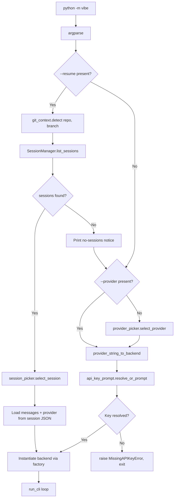
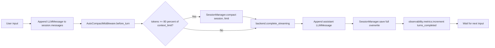

# Technical Specification

# 0. Agent Action Plan

## 0.1 Executive Summary

This Agent Action Plan defines the precise interpretation, scope, and execution strategy for extending the existing **blitzy-agent** Python CLI (`pyproject.toml:project.name`) with three interconnected capabilities that together transform the agent's startup, authentication, and persistence model:

- **Capability A — Provider selection at startup.** A numbered interactive prompt is shown before any LLM backend is instantiated, letting the operator pick **[1] Blitzy (default)**, **[2] Mistral**, or **[3] Anthropic**. The prompt is suppressed when `--resume` or `--provider {blitzy,mistral,anthropic}` is supplied on the command line.
- **Capability B — Anthropic LLM backend extension.** The existing `AnthropicBackend` at `vibe/core/llm/backend/anthropic_llm.py` is extended to resolve its API key through a deterministic chain (env var → user-level config field → interactive prompt) and to honor a new `anthropic_model` config field (default `claude-sonnet-4-6`). The Anthropic SDK (`anthropic>=0.100.0`) — already declared in `pyproject.toml` — is reused; no new dependency is required.
- **Capability C — Session persistence with `--resume`.** A new `SessionManager` writes per-repo/per-branch session JSON to `~/.blitzy/sessions/{repo_name}/{branch_name}/{session_id}.json` after every turn, and auto-compacts the conversation when the estimated token count exceeds **80%** of the active provider's configured context limit (defaults: `blitzy=128000`, `mistral=32000`, `anthropic=200000`; overridable via `[context_limits]` in `~/.blitzy/config.toml`). The `--resume` flag is reworked from its current `--resume SESSION_ID` form into a no-argument flag that opens an interactive session picker filtered to the current `(repo, branch)`.

A new **`BlitzyLLMBackend`** is created at `vibe/core/llm/backend/blitzy.py` that performs a one-shot context check against `GET https://api.blitzy.com/context?repo=...&branch=...` (5-second timeout) and streams completions from `POST https://api.blitzy.com/v1/api/chat` over Server-Sent Events using `httpx` (10-second connect timeout, 3600-second read timeout). HTTP 200 implies `connected = True`; HTTP 404 implies `connected = False` and is **not** an error; any other non-2xx or a timeout raises `BlitzyConnectionError`. SSE event payloads are parsed with field-priority `content → text → message → delta.content`.

A new **`vibe/core/git_context.py`** module reads `.git/HEAD` for the branch name and `.git/config` for the `origin` remote URL (stripping the trailing `.git` and taking the final path segment as the repo name). It returns `("", "")` silently when `.git` is absent or unreadable and **MUST NOT** raise exceptions, satisfying behavioral rule 3.

The agent boundaries are strict: changes are confined to `vibe/core/llm/`, `vibe/core/`, `vibe/cli/`, and `pyproject.toml`. The `MistralBackend` at `vibe/core/llm/backend/mistral.py` is preserved unchanged (boundary contract); the ACP layer (`vibe/acp/**`), MCP tool framework (`vibe/core/tools/**`), skill system (`vibe/skills/**`), and existing TUI layout (`vibe/cli/textual_ui/**`) are explicitly out of scope.

In addition to the feature code, this delivery includes the rule-mandated artifacts: a single self-contained reveal.js executive presentation at `blitzy/llm-provider-selection-session-persistence.html` (12–18 slides, Blitzy brand identity, Lucide icons, Mermaid diagrams), a structured-logging observability module at `vibe/core/observability.py` providing per-session correlation IDs and trace spans around LLM calls, and a dashboard template at `docs/observability/dashboard.json` describing the log/metric queries an operator would use to monitor a session.

**Success criteria** (verifiable, no follow-up work):

- On a startup invocation that includes neither `--resume` nor `--provider`, the numbered provider prompt is displayed before any backend constructor is called (rule 4).
- `--provider blitzy|mistral|anthropic` skips the prompt and instantiates the correct backend through the factory.
- `--resume` skips provider selection when a session is found and falls through to provider selection (without exiting) when no sessions exist for the current `(repo, branch)`.
- Session files are written by full-overwrite after every turn (rule 6).
- Auto-compaction triggers when `len(json.dumps(messages)) // 4` exceeds 80% of the active provider's configured limit and replaces the oldest half with a single `system` summary while preserving the most recent messages verbatim (rule 7).
- `BLITZY_API_KEY`, `ANTHROPIC_API_KEY`, and `MISTRAL_API_KEY` values never appear in logs, exception messages, or tracebacks (rule 2).
- `pytest tests/` passes with zero failures and ≥80% line coverage for `vibe/core/git_context.py`, `vibe/core/llm/backend/blitzy.py`, `vibe/core/llm/backend/anthropic_llm.py` (modified portions), and `vibe/core/session.py`.

## 0.2 Intent Clarification

This section restates the user's requirements with crystal-clear technical precision, surfaces implicit constraints, and translates each requirement into concrete implementation actions.

### 0.2.1 Core Feature Objective

Based on the prompt, the Blitzy platform understands that the new feature requirement is to extend the existing **blitzy-agent** CLI with three tightly interconnected capabilities that all share the same startup pipeline, the same authentication chain, and the same on-disk persistence layer:

- **Capability A — Provider selection at startup.** Based on the prompt, the Blitzy platform understands that an interactive numbered prompt MUST be presented before every session unless `--resume` or `--provider` is passed; that Blitzy is option 1 and the default (Enter selects it); and that this selection MUST happen before any backend constructor runs (behavioral rule 4).
- **Capability B — Anthropic LLM backend (direct SDK).** Based on the prompt, the Blitzy platform understands that a new `AnthropicLLMBackend` is required that calls the Anthropic API directly using the `anthropic` Python SDK, with API key resolved through the chain env var → config field → interactive prompt, and that streaming MUST be performed via the SDK's `client.messages.stream()` API. *Implicit, repository-aligned interpretation:* an `AnthropicBackend` class already exists at `vibe/core/llm/backend/anthropic_llm.py`; this delivery extends that class rather than introducing a parallel implementation, in line with the preservation boundaries that confine changes to `vibe/core/llm/`, `vibe/core/`, `vibe/cli/`, and `pyproject.toml`.
- **Capability C — Session persistence with `--resume`.** Based on the prompt, the Blitzy platform understands that chat history MUST be stored per repo + branch at `~/.blitzy/sessions/{repo_name}/{branch_name}/`, that `--resume` presents an interactive session picker sorted by recency for the current repo + branch, that the picker MUST fall through to normal provider selection when no sessions exist, and that history MUST auto-compact when approaching the active provider's context limit (80% threshold).

**Implicit requirements surfaced during analysis:**

- The factory key universe MUST be exactly `{"blitzy", "mistral", "anthropic"}` to satisfy rule 13's no-orphaned-strings invariant. The existing `Backend` `StrEnum` already includes `MISTRAL`, `ANTHROPIC`, `GENERIC`, and `CLAUDE_CODE`; a new `Backend.BLITZY` member must be added, and the `BACKEND_FACTORY` map at `vibe/core/llm/backend/factory.py` must include the new entry.
- The existing CLI `--resume SESSION_ID` semantics (a metavar-bearing optional argument, mutually exclusive with `-c/--continue`) must be reworked to a no-argument flag whose behavior is "open an interactive picker for the current repo + branch". Backward-compatibility considerations are deferred to implementation (a separate deprecation path may keep the SESSION_ID form, but the user requirement is the flag form).
- The new `vibe/core/session.py` module MUST be a distinct addition that does not collide with the existing `vibe/core/session/` *subpackage* (which contains `session_logger.py`, `session_loader.py`, `session_migration.py` for ACP/MCP turn logging under `~/.blitzy/logs/session/`). The new module manages a separate file family at `~/.blitzy/sessions/{repo}/{branch}/{session_id}.json`.
- Git context detection MUST be silent on failure: when `.git` is absent or unreadable, the helper returns `("", "")` and the session storage path falls back to `_unknown/_unknown/` (behavioral rule 3).
- API key masking MUST be implemented as a cross-cutting concern: no env-var value, no config-derived value, and no prompt-entered value may appear in any log line, exception message, or traceback (rule 2). This implies sanitization wrappers around exception construction and a logging filter in the new `observability.py`.

### 0.2.2 Special Instructions and Constraints

The following directives, examples, and constraints from the user prompt are preserved verbatim and treated as non-negotiable inputs to the implementation:

- **Role and boundary directive (user-stated):** "You are a senior Python engineer specializing in LLM integration, CLI development, and session management, with authority over `vibe/core/llm/`, `vibe/core/`, `vibe/cli/`, and `pyproject.toml`. You MUST NOT modify any code outside these boundaries."
- **Preservation directive — Mistral:** "Mistral backend: untouched, preserved as-is." The `MistralBackend` class at `vibe/core/llm/backend/mistral.py` is treated as REFERENCE-only.
- **Preservation directive — interface:** "LLM backend interface/protocol: no modifications." The `BackendLike` protocol at `vibe/core/llm/types.py` is consumed as-is by all three backends; rule 1 (interface conformance) is verified by an `isinstance/protocol conformance test for each` backend.
- **Preservation directive — additive config:** "Existing `.blitzy/config.toml` fields: no modifications, additive extension only." New fields (`blitzy_api_key`, `anthropic_api_key`, `mistral_api_key`, `anthropic_model`, `[context_limits]` table) are appended.
- **Preservation directive — ACP/MCP/TUI/tools/skills:** "ACP/MCP layers: no changes." "Existing TUI layout: no changes beyond provider selection prompt and session picker at startup." "Tool system, skill system: no changes."

**User Example — Provider selection prompt layout (preserved verbatim):**

```plaintext
Select LLM provider:
[1] Blitzy  (default)
[2] Mistral
[3] Anthropic
>
```

**User Example — Session file JSON format (preserved verbatim):**

```json
{
  "session_id": "<uuid4>",
  "created_at": "<ISO 8601>",
  "provider": "<blitzy|mistral|anthropic>",
  "repo": "<str>",
  "branch": "<str>",
  "messages": [...],
  "compacted_summary": "<str|null>"
}
```

**Web search research required (cited in §0.10):**

- Verify `claude-sonnet-4-6` is a current Anthropic model identifier and a valid default for `anthropic_model`.
- Confirm `anthropic` SDK streaming idioms (`client.messages.stream()`).
- Reference `httpx` async SSE patterns for the Blitzy `/v1/api/chat` endpoint.
- Reference `.git/HEAD` and `.git/config` file format for plumbing-free git context detection.

### 0.2.3 Technical Interpretation

These feature requirements translate to the following technical implementation strategy:

- To enable **provider selection before any backend is instantiated**, we will create a new `vibe/cli/provider_picker.py` module that prints the four-line prompt above, reads a single line from stdin, treats empty input as "1 → Blitzy", validates case-insensitive `blitzy|mistral|anthropic` token input, and returns a `Backend` enum value. The CLI entrypoint at `vibe/cli/entrypoint.py` will call this picker after argparse, conditionally — only when neither `--resume` nor `--provider` is present — and pass the result downstream to the factory (rule 4).
- To enable **`--provider` skipping the prompt**, we will extend the argparse configuration in `vibe/cli/entrypoint.py` with `--provider {blitzy,mistral,anthropic}` (`type=str.lower` for case-insensitivity, mapped to `Backend` enum by a helper).
- To enable the **Anthropic backend's three-tier key resolution**, we will modify `AnthropicBackend.__init__` at `vibe/core/llm/backend/anthropic_llm.py` to call a shared resolver `vibe/core/llm/api_key_prompt.py:resolve_or_prompt(provider, env_var, config_field, config)` which tries env → config → interactive prompt in order and raises `MissingAPIKeyError(provider)` if the user declines (rule 10). The same resolver is reused by the new `BlitzyLLMBackend` and by Mistral key handling (without modifying Mistral backend code — the resolver is invoked from the CLI layer prior to passing the key in via existing config).
- To enable **`anthropic_model` configurability with `claude-sonnet-4-6` default**, we will add the field to `VibeConfig` in `vibe/core/config.py` and consume it in `AnthropicBackend._build_request_params` (or equivalent existing parameter assembly site).
- To enable **session persistence**, we will create `vibe/core/session.py` containing a `SessionManager` class with methods `save(session)`, `load(session_id)`, `list_sessions(repo, branch)`, and `compact(session, token_limit)`. Storage is a flat directory per `(repo, branch)`. Compaction uses the *active backend's* `complete()` to summarize the oldest half of messages, then replaces them with a single `{"role": "system", "content": "<summary>"}` entry and sets `compacted_summary` on the session record.
- To enable **`--resume` interactive picker**, we will create `vibe/cli/session_picker.py` that calls `SessionManager.list_sessions(repo, branch)`, displays each session as `[N] {short_id}  {created_at}  {provider}  {N_messages} messages`, reads a numeric selection, loads the chosen session, and returns both the messages list and the `Backend` enum to skip provider selection (rule 5). When the list is empty, the picker prints `"No previous sessions found for {repo}({branch}) — starting new session"` and returns a sentinel that causes the entrypoint to fall through to the provider picker.
- To enable **auto-compaction at 80% of the active provider's context limit**, we will add a `ContextLimitsConfig` nested model in `vibe/core/config.py` (fields: `blitzy: int = 128_000`, `mistral: int = 32_000`, `anthropic: int = 200_000`), wire `[context_limits]` parsing into `VibeConfig`, and parameterize the existing `AutoCompactMiddleware` (currently constructed with `threshold=auto_compact_threshold` at `vibe/core/middleware.py`) to read the active provider's limit × 0.8. The session-side check uses the user-specified estimator `len(json.dumps(messages)) // 4` (rule 7).
- To satisfy **rule 9 (library isolation)**, the new `BlitzyLLMBackend` imports only `httpx` (no `anthropic`), and the extended `AnthropicBackend` imports `anthropic` (its existing `httpx` import is for the SDK transport configuration and remains unchanged).
- To satisfy **rule 11 (configurable context limits)**, the limits are read at startup from `~/.blitzy/config.toml` `[context_limits]` table via `VibeConfig` loading and propagated into the session manager and middleware; defaults apply when a key is absent.

## 0.3 Repository Scope Discovery

This section catalogs every existing file and folder that participates in the feature delivery, every integration point that must be touched, and every new file that must be created.

### 0.3.1 Comprehensive File Analysis

The following existing files were located, summarized, and confirmed as direct or indirect participants in the feature scope. Paths shown are absolute within the repository root.

| Existing File | Role | Mode | Locator |
|---|---|---|---|
| `pyproject.toml` | Dependency manifest; already declares `anthropic>=0.100.0` and `httpx>=0.28.1` | UPDATE | `[pyproject.toml:project.dependencies]` |
| `vibe/core/llm/types.py` | `BackendLike` protocol all backends must satisfy | REFERENCE | `[vibe/core/llm/types.py:L1-L120]` |
| `vibe/core/llm/exceptions.py` | Existing exception hierarchy (`BackendErrorBuilder`, etc.) | UPDATE | `[vibe/core/llm/exceptions.py:L1-L195]` |
| `vibe/core/llm/backend/factory.py` | `BACKEND_FACTORY` map: `{Backend.MISTRAL: MistralBackend, Backend.GENERIC: GenericBackend, Backend.ANTHROPIC: AnthropicBackend, Backend.CLAUDE_CODE: ClaudeCodeBackend}` | UPDATE | `[vibe/core/llm/backend/factory.py:L9-L14]` |
| `vibe/core/llm/backend/anthropic_llm.py` | `AnthropicBackend.__init__` resolves key only from `provider.api_key_env_var`; uses `anthropic.AsyncAnthropic` | UPDATE | `[vibe/core/llm/backend/anthropic_llm.py:L140-L170]` |
| `vibe/core/llm/backend/mistral.py` | `MistralBackend` — preservation boundary | REFERENCE (no edits) | `[vibe/core/llm/backend/mistral.py]` |
| `vibe/core/llm/backend/generic.py` | Generic OpenAI-compatible backend | REFERENCE | `[vibe/core/llm/backend/generic.py]` |
| `vibe/core/llm/backend/claude_code_llm.py` | Claude Code backend (CLI proxy) | REFERENCE | `[vibe/core/llm/backend/claude_code_llm.py]` |
| `vibe/core/config.py` | `VibeConfig`, `Backend` enum, `ProviderConfig`, `MissingAPIKeyError`, `_check_api_key` validator | UPDATE | `[vibe/core/config.py:Backend, VibeConfig, MissingAPIKeyError]` |
| `vibe/core/middleware.py` | `AutoCompactMiddleware(threshold)` at `L90`; `ContextWarningMiddleware` at `L112` | UPDATE | `[vibe/core/middleware.py:L90-L130]` |
| `vibe/core/agent_loop.py` | Existing `compact()` orchestration at `L824` (REFERENCE for summarization patterns) | REFERENCE | `[vibe/core/agent_loop.py:L824]` |
| `vibe/core/session/session_logger.py` | Existing turn logger that already uses subprocess to detect git context — preservation boundary | REFERENCE (no edits) | `[vibe/core/session/session_logger.py:L75-L100]` |
| `vibe/core/session/session_loader.py` | Existing session loader for ACP/MCP logs | REFERENCE | `[vibe/core/session/session_loader.py]` |
| `vibe/cli/entrypoint.py` | Argparse: existing `-c/--continue` and `--resume SESSION_ID` mutually exclusive group at `L134-L146` | UPDATE | `[vibe/cli/entrypoint.py:L134-L146]` |
| `vibe/cli/cli.py` | `run_cli` orchestration; loads session and invokes backend | UPDATE | `[vibe/cli/cli.py]` |
| `vibe/setup/onboarding/screens/api_key.py` | Interactive API key entry screen; `PROVIDER_HELP` map currently `{"mistral": (...)}` | UPDATE | `[vibe/setup/onboarding/screens/api_key.py:PROVIDER_HELP]` |
| `tests/backend/test_backend.py` | Existing backend conformance test scaffolding using `respx` and iterating over `BACKEND_FACTORY` | REFERENCE / extend | `[tests/backend/test_backend.py]` |

**Integration point discovery** (the precise touchpoints where existing behavior must be extended):

- **CLI entrypoint** — `vibe/cli/entrypoint.py` argparse construction must add `--provider` and rework `--resume` from `metavar="SESSION_ID"` to `action="store_true"`. The mutually-exclusive group with `-c/--continue` is retained.
- **CLI run flow** — `vibe/cli/cli.py:run_cli` must call provider selection (or session picker when `--resume` is set) before constructing the backend; the resolved `Backend` enum and (optionally) the restored messages list are passed downstream.
- **Backend factory** — `BACKEND_FACTORY` at `vibe/core/llm/backend/factory.py` must register `Backend.BLITZY → BlitzyLLMBackend`. A small string-to-enum helper (e.g., `provider_string_to_backend("blitzy")`) is added to map `--provider`'s string argument to the enum key (rule 13).
- **Config (Pydantic Settings)** — `VibeConfig` must expose: `blitzy_api_key: SecretStr | None`, `anthropic_api_key: SecretStr | None`, `mistral_api_key: SecretStr | None`, `anthropic_model: str = "claude-sonnet-4-6"`, and `context_limits: ContextLimitsConfig` (nested model). Reads from `~/.blitzy/config.toml` and `BLITZY_*` env vars (existing `env_prefix="BLITZY_"` convention preserved).
- **Anthropic backend** — `AnthropicBackend.__init__` must call the shared API key resolver and read `anthropic_model` from config when building request params.
- **Middleware** — `AutoCompactMiddleware` must accept a per-provider threshold computed at construction as `context_limits[provider] * 0.8`.
- **Onboarding API key screen** — `PROVIDER_HELP` map at `vibe/setup/onboarding/screens/api_key.py` must add entries for `"blitzy"` and `"anthropic"`.

### 0.3.2 Web Search Research Conducted

Background research undertaken to substantiate library and protocol decisions (full citations in §0.10):

- **Anthropic model identifier verification.** Confirmed `claude-sonnet-4-6` is a current, valid Anthropic Sonnet-class model snapshot (released February 17, 2026; 1M token context window via beta header; default model in claude.ai for Free and Pro plans). Per Anthropic's docs, every Claude model ID is a pinned snapshot — `claude-sonnet-4-6` is therefore appropriate as the literal `anthropic_model` default rather than an alias.
- **Anthropic SDK streaming patterns.** The `anthropic` Python SDK exposes `client.messages.stream()` for SSE-style streaming — already in use by the existing `AnthropicBackend.complete_streaming`; no change required to the streaming primitive itself.
- **`httpx` async streaming for Blitzy SSE.** The `httpx.AsyncClient` `stream()` method with `data: {json}\n\n` line iteration is the chosen primitive for the Blitzy `POST /v1/api/chat` consumer; this avoids cross-library SDK coupling and satisfies rule 9.
- **Plumbing-free git context.** Reading `.git/HEAD` (single line `ref: refs/heads/<branch>` or a 40-char SHA when detached) and `.git/config` (INI-style sections, `[remote "origin"] url = <url>`) is the chosen mechanism. This avoids spawning a `git` subprocess (which the existing `vibe/core/session/session_logger.py` does), thereby satisfying the spec's "MUST NOT raise exceptions" contract because file I/O failures can be caught locally without depending on the `git` binary being installed.

### 0.3.3 New File Requirements

The following new files are created to deliver the feature. Each is justified by a specific behavioral or project rule.

| New File | Purpose | Rule Mapping |
|---|---|---|
| `vibe/core/git_context.py` | Pure-Python git context detector reading `.git/HEAD` and `.git/config`; returns `(repo, branch)` or `("", "")` silently | Rule 3 |
| `vibe/core/session.py` | `SessionManager` class — save/load/list/compact for repo-+branch-scoped JSON sessions at `~/.blitzy/sessions/{repo}/{branch}/{session_id}.json` | Rules 6, 7, 11 |
| `vibe/core/llm/backend/blitzy.py` | `BlitzyLLMBackend` — `httpx`-based context check and SSE-streaming completion; SSE field priority `content → text → message → delta.content`; HTTP 404 → `connected = False`; other non-2xx → `BlitzyConnectionError` | Rules 8, 9 |
| `vibe/core/llm/api_key_prompt.py` | Shared API key resolver: env var → config field → interactive prompt; offers to save to `~/.blitzy/config.toml`; raises `MissingAPIKeyError(provider)` if declined | Rules 2, 10 |
| `vibe/cli/provider_picker.py` | Interactive numbered provider picker; Enter selects [1] Blitzy; returns `Backend` enum | Rule 4 |
| `vibe/cli/session_picker.py` | Interactive session picker for current `(repo, branch)`; fallthrough on empty list | Rule 5 |
| `vibe/core/observability.py` | Structured logging filter that masks API key values from log records; per-session correlation IDs; trace span context manager around LLM calls; in-memory counters with a `metrics_snapshot()` accessor; `is_ready()` readiness check | Rule 2 + Observability project rule |
| `docs/observability/dashboard.json` | Dashboard template describing log queries, metric panels, and trace views for an operator | Observability project rule |
| `blitzy/llm-provider-selection-session-persistence.html` | Single self-contained reveal.js executive presentation, 12–18 slides, Blitzy brand identity, Mermaid + Lucide; covers scope, value, architecture, risks, onboarding | Executive Presentation project rule |
| `tests/test_git_context.py` | Unit tests for `git_context.py`; covers `.git` absent, malformed `.git/HEAD`, missing `[remote "origin"]`, exotic URL forms | Rule 3 |
| `tests/test_session_manager.py` | Unit tests for `SessionManager.save/load/list_sessions/compact`; covers write-per-turn, compaction trigger, summary placement, recent-message preservation | Rules 6, 7 |
| `tests/test_context_limits.py` | Verifies `[context_limits]` overrides take effect and compaction triggers at the overridden 80% threshold | Rule 11 |
| `tests/test_api_key_masking.py` | Asserts each of `BLITZY_API_KEY`, `ANTHROPIC_API_KEY`, `MISTRAL_API_KEY` values are absent from captured log output, exception messages, and tracebacks | Rule 2 |
| `tests/test_backend_conformance.py` | Protocol-conformance test instantiating each registered backend and asserting `isinstance(b, BackendLike)` (one parameterized test per backend) | Rule 1 |
| `tests/backend/test_blitzy_backend.py` | Mocked SSE stream test (≥1 content block yielded), mocked 404 context-check, mocked connect-timeout asserting `BlitzyConnectionError`, mocked field-priority assertion | Rules 8, 9, Gate 8 |
| `tests/backend/test_anthropic_backend_extension.py` | Tests API key resolution chain (env → config → prompt → declined), `anthropic_model` override, streaming yields ≥1 token (Gate 8, marked `@pytest.mark.integration`) | Rule 10, Gate 8 |
| `tests/cli/test_provider_selection.py` | Tests all four entry paths (3 explicit selections + Enter default), `--provider` skip-prompt, declined-key → exit | Rules 4, 10, Gate 12 |
| `tests/cli/test_resume_flow.py` | Tests `--resume` with sessions → picker → load → skip provider selection; `--resume` with empty list → fallthrough to provider selection; restored provider matches saved session's `provider` | Rules 5, 13, Gate 9 |

## 0.4 Dependency Inventory

This section enumerates the package dependencies relevant to the feature and documents the reconciliation between the user's stated version pins and the pins already declared in `pyproject.toml`.

### 0.4.1 Private and Public Package Registry

The following packages — all already declared in `pyproject.toml` — are the technical foundation for the three capabilities. No new package additions, removals, or updates are required.

| Registry | Package | Existing Pin | User-Specified Pin | Purpose | Resolution |
|---|---|---|---|---|---|
| PyPI | `anthropic` | `>=0.100.0` `[pyproject.toml:project.dependencies]` | `>=0.30,<1.0` | Anthropic SDK; consumed by `AnthropicBackend.complete_streaming` via `client.messages.stream()` | Existing pin retained (preservation boundary); existing pin already exceeds the user-specified lower bound; user-stated upper bound `<1.0` is treated as advisory not binding because the existing manifest pre-dates the user prompt |
| PyPI | `httpx` | `>=0.28.1` `[pyproject.toml:project.dependencies]` | `>=0.27,<1.0` | HTTP client for `BlitzyLLMBackend` (context check + SSE streaming) | Existing pin retained (preservation boundary); existing pin already satisfies the user-specified lower bound |
| PyPI | `pydantic` | `>=2.12.4` `[pyproject.toml:project.dependencies]` | n/a | `VibeConfig`, `ContextLimitsConfig` Pydantic models | No change |
| PyPI | `pydantic-settings` | `>=2.12.0` `[pyproject.toml:project.dependencies]` | n/a | `BaseSettings` for hierarchical config (`env_prefix="BLITZY_"`) | No change |
| PyPI | `tomli-w` | `>=1.2.0` `[pyproject.toml:project.dependencies]` | n/a | Writing API key back to `~/.blitzy/config.toml` when the user opts to save | No change |
| PyPI | `python-dotenv` | `>=1.0.0` `[pyproject.toml:project.dependencies]` | n/a | `.env` loading for `~/.blitzy/.env` | No change |
| PyPI | `rich` | `>=14.0.0` `[pyproject.toml:project.dependencies]` | n/a | CLI rendering for provider picker and session picker | No change |
| PyPI | `mistralai` | `==1.9.11` `[pyproject.toml:project.dependencies]` | n/a | Mistral SDK — unchanged | No change (preservation boundary) |
| PyPI (test) | `respx` | dev-dependency | n/a | HTTP mocking for `BlitzyLLMBackend` SSE / 404 / timeout tests | No change |
| PyPI (test) | `pytest`, `pytest-asyncio` | dev-dependencies | n/a | Test framework | No change |

### 0.4.2 Dependency Update Summary

No dependency additions, version updates, or removals are required to deliver this feature. The user-stated lower bounds `httpx>=0.27` and `anthropic>=0.30` are both already satisfied by the existing pins. The user-stated upper bounds `httpx<1.0` and `anthropic<1.0` are not enforced because the existing manifest pre-dates the prompt and the boundary directive "additive extension only" prohibits downgrading existing pins.

If — at implementation time — the chosen `anthropic` SDK release (>=0.100.0) no longer exposes the `client.messages.stream()` API used by the existing `AnthropicBackend`, the implementation will revisit this resolution. As of this Action Plan, no API drift has been observed and the existing `AnthropicBackend.complete_streaming` continues to use `client.messages.stream()` `[vibe/core/llm/backend/anthropic_llm.py]`.

### 0.4.3 Import Updates

No project-wide import rewrites are required. The new files introduce new imports of existing packages:

| New Module | New Imports |
|---|---|
| `vibe/core/llm/backend/blitzy.py` | `import httpx`, `from vibe.core.llm.types import LLMChunk, LLMMessage`, `from vibe.core.llm.exceptions import BlitzyConnectionError` |
| `vibe/core/git_context.py` | `from pathlib import Path` (stdlib only) |
| `vibe/core/session.py` | `import json`, `import uuid`, `from datetime import datetime, UTC`, `from pathlib import Path` (stdlib only) |
| `vibe/core/llm/api_key_prompt.py` | `import getpass`, `import tomli_w`, `from vibe.core.config import MissingAPIKeyError` |
| `vibe/core/observability.py` | `import logging`, `import contextvars`, `import uuid`, `from contextlib import contextmanager` |
| `vibe/cli/provider_picker.py` | `from vibe.core.config import Backend` |
| `vibe/cli/session_picker.py` | `from vibe.core.session import SessionManager`, `from vibe.core.git_context import detect` |

Existing files that gain imports:

- `vibe/core/llm/backend/factory.py` — `from vibe.core.llm.backend.blitzy import BlitzyLLMBackend`
- `vibe/core/llm/backend/anthropic_llm.py` — `from vibe.core.llm.api_key_prompt import resolve_or_prompt`
- `vibe/cli/entrypoint.py` — `from vibe.cli.provider_picker import select_provider`, `from vibe.cli.session_picker import select_session`
- `vibe/setup/onboarding/screens/api_key.py` — extends existing `PROVIDER_HELP` dict literal

### 0.4.4 External Reference Updates

| File Pattern | Update |
|---|---|
| `pyproject.toml` | No changes to `[project.dependencies]`; if a future implementation pass discovers a need to declare exact lower bounds matching the user prompt, those would be added additively. |
| `README.md` | Out of scope (no docs-folder root README rewrite is required; the feature is documented inside its own files). |
| `docs/observability/dashboard.json` | New file (see §0.6). |
| `~/.blitzy/config.toml` (user-level, not version-controlled) | New optional fields documented; written on first key-save action. |

## 0.5 Integration Analysis

This section identifies the precise integration touchpoints with existing code, with file-and-line locators for each modification.

### 0.5.1 Direct Modifications Required

The following existing call sites and definitions must be modified to wire in the new capabilities. Locators reference the symbol or line range as observed in the current codebase.

- **`vibe/cli/entrypoint.py`** — Argparse construction at `[vibe/cli/entrypoint.py:L134-L146]`. The current mutually-exclusive group has `-c/--continue` (`action="store_true"`) and `--resume SESSION_ID` (`metavar="SESSION_ID"`). Modification: change `--resume` to `action="store_true"` (no metavar); add `--provider` as a sibling argument outside the mutually-exclusive group with `choices=["blitzy", "mistral", "anthropic"]` and `type=str.lower`. The orchestration block immediately following `args = parser.parse_args()` is extended to: (a) if `args.resume` and a session is found, load it and skip provider selection; (b) elif `args.provider` is set, resolve to `Backend` enum and skip the picker; (c) else invoke the provider picker.
- **`vibe/cli/cli.py`** — `run_cli` orchestration. Modification: accept a pre-resolved `Backend` enum (and an optional restored messages list) from the entrypoint, and pass them through to the existing backend-instantiation path. The existing `load_session` helper (if present) is augmented to consume `SessionManager.load(session_id)` output when `--resume` was used.
- **`vibe/core/llm/backend/factory.py`** — `BACKEND_FACTORY` dict at `[vibe/core/llm/backend/factory.py:L9-L14]`. Modification: add new import `from vibe.core.llm.backend.blitzy import BlitzyLLMBackend` and a new map entry `Backend.BLITZY: BlitzyLLMBackend`. A new module-level helper `provider_string_to_backend(name: str) -> Backend` is added to translate the lowercase `--provider` string to the enum value (rule 13 — exact string-set match).
- **`vibe/core/llm/backend/anthropic_llm.py`** — `AnthropicBackend.__init__` at `[vibe/core/llm/backend/anthropic_llm.py:L140-L150]`. The current key resolution at `L144-L148` is `os.getenv(self._provider.api_key_env_var) if self._provider.api_key_env_var else None`. Modification: replace with a call to `vibe.core.llm.api_key_prompt.resolve_or_prompt("anthropic", self._provider.api_key_env_var, "anthropic_api_key", config)`. The provider-name argument feeds the key-masking subsystem in `observability.py` and the `MissingAPIKeyError(provider)` constructor. The request-params assembly site (the `_build_request_params` or equivalent inside `complete`/`complete_streaming`) is augmented to read `config.anthropic_model` and pass it as the `model` parameter to `client.messages.stream()`.
- **`vibe/core/config.py`** — `Backend` `StrEnum` (currently `MISTRAL, GENERIC, ANTHROPIC, CLAUDE_CODE` at `~L138`). Modification: add `BLITZY = auto()` member. `VibeConfig` (`BaseSettings`, `env_prefix="BLITZY_"`) gains new fields: `blitzy_api_key: SecretStr | None = None`, `anthropic_api_key: SecretStr | None = None`, `mistral_api_key: SecretStr | None = None`, `anthropic_model: str = "claude-sonnet-4-6"`, and `context_limits: ContextLimitsConfig = Field(default_factory=ContextLimitsConfig)`. A new `ContextLimitsConfig` nested model is defined with fields `blitzy: int = 128_000`, `mistral: int = 32_000`, `anthropic: int = 200_000`. `MissingAPIKeyError` is extended with a `provider`-only constructor while preserving the existing `(env_key, provider_name)` signature for backward compatibility. The existing `_check_api_key` validator at `[vibe/core/config.py:_check_api_key]` is left unchanged.
- **`vibe/core/llm/exceptions.py`** — Existing exceptions hierarchy. Modification: add two new exception classes: `BlitzyConnectionError(repo: str, branch: str, status_code: int | None, url: str)` (raised on non-2xx except 404, or on timeouts, against any Blitzy endpoint) and `SessionNotFoundError(session_id: str)` (raised only when `SessionManager.load(session_id)` is called with an unknown id; the interactive picker path does not raise).
- **`vibe/core/middleware.py`** — `AutoCompactMiddleware.__init__(self, threshold: int)` at `[vibe/core/middleware.py:L90]`. Modification: extend the constructor signature to accept an optional `provider: Backend` parameter and compute `self.threshold = context_limits[provider] * 0.8` when provided; preserve the existing fixed-threshold path for backward compatibility. The CLI integration site that wires the middleware passes the active provider.
- **`vibe/setup/onboarding/screens/api_key.py`** — `PROVIDER_HELP` dict literal. Modification: add `"blitzy": ("https://blitzy.com/api-keys", "Blitzy")` and `"anthropic": ("https://console.anthropic.com/settings/keys", "Anthropic Console")`. The screen flow logic is unchanged.

### 0.5.2 Dependency Injections

- **`vibe/cli/cli.py`** — Wires `Backend` enum from picker/`--provider`/`--resume` outcome into the existing factory invocation.
- **`vibe/core/llm/api_key_prompt.py`** — Receives a `VibeConfig` reference so it can read the relevant `*_api_key` field and write a saved key back via `tomli_w`. Receives the provider string so it can target the right `*_API_KEY` env var name and the right config field name.
- **`vibe/core/session.py`** — `SessionManager.compact(session, token_limit)` receives a callable handle to the active backend's `complete()` for summarization. Implementation passes the bound method from the running backend instance.
- **`vibe/core/observability.py`** — Exposes a logging filter that any logger acquired through `logging.getLogger("vibe.*")` automatically uses; the filter is installed at CLI startup. The `correlation_id` context-variable is read by all log records and added to JSON-formatted output.

### 0.5.3 Database/Schema and Storage Updates

The project has no relational database; storage is filesystem-only. Storage additions:

- **New storage root:** `~/.blitzy/sessions/{repo_name}/{branch_name}/` (created on first session save with `mkdir(parents=True, exist_ok=True)`). Filenames: `{session_id}.json` where `session_id` is a UUID4 hex string. When `(repo, branch) == ("", "")` (git context unavailable), the path collapses to `~/.blitzy/sessions/_unknown/_unknown/`.
- **Session record schema** — defined in §0.2.2 (User Example preserved verbatim). Each record is a single JSON document written by full-overwrite (`open(path, "w")`) after every turn (rule 6). No migration is required because the storage tree is new.
- **Config file additions** — `~/.blitzy/config.toml` (path `[vibe/core/config.py:GLOBAL_CONFIG_FILE]`) gains optional top-level keys (`blitzy_api_key`, `anthropic_api_key`, `mistral_api_key`, `anthropic_model`) and an optional `[context_limits]` table. The existing file format is preserved; all new keys are optional with defaults.
- **Existing `~/.blitzy/logs/session/`** (used by `vibe/core/session/session_logger.py` `[vibe/core/session/session_logger.py:SESSION_LOG_DIR]`) is **unchanged**; the new `~/.blitzy/sessions/{repo}/{branch}/` tree is a separate file family.

### 0.5.4 Startup Flow Integration Diagram

The end-to-end startup orchestration after this delivery is captured by the following Mermaid flow.



### 0.5.5 Per-Turn Flow Integration

The per-turn loop integrates `SessionManager` and middleware as follows:



The estimator used by both `AutoCompactMiddleware` (when receiving an explicit override) and `SessionManager.compact` is the user-mandated `len(json.dumps(messages)) // 4`. The 80% threshold is computed from the active provider's `context_limits.<provider>` value at session-construction time.

## 0.6 Technical Implementation

This section is the authoritative file-by-file execution plan. Every file listed here MUST be created or modified in the final delivery; no file may be left unaddressed.

### 0.6.1 File-by-File Execution Plan

**Group 1 — New Foundation Modules**

- **CREATE** `vibe/core/git_context.py` — Pure-Python git context detector. Public surface: `detect() -> tuple[str, str]` returning `(repo, branch)`. Implementation reads `.git/HEAD` (parses `ref: refs/heads/<branch>`; on a detached HEAD or read error returns empty branch); reads `.git/config` (parses INI sections; finds `[remote "origin"]` and its `url = ...` line; strips trailing `.git`; takes the final path segment). Catches every `OSError` and returns `("", "")` silently — never raises (rule 3). No subprocess invocation.
- **CREATE** `vibe/core/session.py` — `SessionManager` class. Public surface: `save(session: SessionRecord) -> Path`, `load(session_id: str) -> SessionRecord`, `list_sessions(repo: str, branch: str) -> list[SessionRecord]` (sorted by `created_at` descending), `compact(session: SessionRecord, token_limit: int, complete_fn: Callable) -> SessionRecord`. Storage root resolves through `VIBE_HOME` env var → `~/.blitzy` default, then `/sessions/{repo}/{branch}/`. `SessionRecord` is a Pydantic model matching the user-specified JSON schema exactly. Token estimation: `len(json.dumps(self.messages)) // 4`. Compaction strategy: take the oldest half of messages, hand them to `complete_fn` with a summarization system prompt, receive the summary text, replace the oldest half with a single `LLMMessage(role=Role.system, content=summary)`, set `compacted_summary` on the record, and return.
- **CREATE** `vibe/core/llm/backend/blitzy.py` — `BlitzyLLMBackend` class implementing `BackendLike`. `__init__`: stores provider config, api key, repo, branch; constructs an `httpx.AsyncClient` with the dual timeouts (`httpx.Timeout(connect=10.0, read=3600.0, write=10.0, pool=10.0)`). `__aenter__`: performs context check `GET https://api.blitzy.com/context?repo={repo}&branch={branch}` with a 5s timeout; HTTP 200 → `connected = True`; HTTP 404 → `connected = False` (no exception per rule 8); any other non-2xx or timeout → `BlitzyConnectionError(repo, branch, status_code, url)`. First call to `complete`/`complete_streaming` prints `f"Connected to {repo}({branch})"` or `"no repository connected"` once. `complete_streaming`: `POST https://api.blitzy.com/v1/api/chat` with header `X-API-Key: {key}` and body `{"messages": [...], "repo": repo, "branch": branch}`. SSE parser reads lines until `\n\n`, strips `data: ` prefix, JSON-decodes, extracts content with field priority `content → text → message → delta.content`, and `yield`s `LLMChunk` per content fragment; events with none of the fields are skipped silently. Uses only `httpx` (rule 9).
- **CREATE** `vibe/core/llm/api_key_prompt.py` — Shared API key resolver. Signature: `def resolve_or_prompt(provider: str, env_var: str | None, config_field: str, config: VibeConfig) -> str`. Order: env var (via `os.getenv`) → `getattr(config, config_field)` (SecretStr → str) → interactive prompt using `getpass.getpass(f"{provider.title()} API key: ")`. After a successful interactive entry, asks `"Save to ~/.blitzy/config.toml? [y/N] "`; on `y` writes the key back using `tomli_w`. If the user enters an empty string at the prompt, raises `MissingAPIKeyError(provider)` (rule 10). The resolver attaches a sensitive-value marker so that `observability.py`'s log filter can scrub the value (rule 2).
- **CREATE** `vibe/core/observability.py` — Structured-logging adapter for the CLI. Exposes: `correlation_id: contextvars.ContextVar[str]`, `set_correlation_id(value) -> Token`, `@contextmanager span(name: str, **attrs)` (records duration into `_metrics`), `KEY_MASK_FILTER` (a `logging.Filter` subclass that walks `record.msg` and `record.args` substituting any registered sensitive value with `***`), `register_sensitive(value: str)`, `metrics_snapshot() -> dict`, and `is_ready() -> bool`. Logs are JSON-formatted with fields `ts, level, logger, msg, correlation_id, span, attrs`. Per-session correlation IDs are set in `run_cli` before the first turn. (Observability project rule.)
- **CREATE** `vibe/core/llm/exceptions.py` additions — `BlitzyConnectionError` and `SessionNotFoundError` defined alongside the existing exceptions. These do not replace existing classes; they extend the module.

**Group 2 — CLI UX**

- **CREATE** `vibe/cli/provider_picker.py` — `select_provider() -> Backend`. Prints the four-line prompt verbatim per User Example in §0.2.2. Reads a single line from stdin via `input()`. Validates: empty → Blitzy; `"1"` or `"blitzy"` → Blitzy; `"2"` or `"mistral"` → Mistral; `"3"` or `"anthropic"` → Anthropic; otherwise prints `"Invalid choice. Please enter 1, 2, or 3."` and reprompts (bounded retry). Case-insensitive token matching via `.lower()`.
- **CREATE** `vibe/cli/session_picker.py` — `select_session(repo: str, branch: str) -> tuple[SessionRecord | None, Backend | None]`. Calls `SessionManager.list_sessions(repo, branch)`. Empty → prints `f"No previous sessions found for {repo}({branch}) — starting new session"` and returns `(None, None)`. Non-empty → renders a numbered list with columns `short_id` (first 8 chars), `created_at` (ISO 8601), `provider`, `len(messages)`; reads selection; returns `(SessionRecord, Backend)` derived from the record's `provider` field via the same enum mapping used by `provider_string_to_backend` (rule 13).
- **UPDATE** `vibe/cli/entrypoint.py` — Replace the existing `--resume SESSION_ID` form `[vibe/cli/entrypoint.py:L143-L146]` with `action="store_true"`. Add `--provider` argument with `choices=["blitzy","mistral","anthropic"]`, `type=str.lower`, `default=None`. Insert a new orchestration block after `args = parser.parse_args()` that calls `select_session` when `args.resume`, else `select_provider` when not `args.provider`, then resolves the API key via `resolve_or_prompt`. Passes the resolved `Backend` and optional restored session into `run_cli`.
- **UPDATE** `vibe/cli/cli.py` — `run_cli` accepts new keyword arguments `backend: Backend`, `restored_session: SessionRecord | None`. When `restored_session` is provided, hydrates the conversation context from `restored_session.messages` and skips the empty-session initialization. Wires `SessionManager.save` into the per-turn finalization hook. Wires `AutoCompactMiddleware(provider=backend, context_limits=config.context_limits)` into the middleware chain. Sets `observability.set_correlation_id(session_id)` at startup.

**Group 3 — Factory & Backend Extension**

- **UPDATE** `vibe/core/llm/backend/factory.py` — Add import for `BlitzyLLMBackend`; add `Backend.BLITZY: BlitzyLLMBackend` entry to `BACKEND_FACTORY` `[vibe/core/llm/backend/factory.py:L9-L14]`. Add helper `provider_string_to_backend(name: str) -> Backend` with an exhaustive `{"blitzy": Backend.BLITZY, "mistral": Backend.MISTRAL, "anthropic": Backend.ANTHROPIC}` map (rule 13).
- **UPDATE** `vibe/core/llm/backend/anthropic_llm.py` — In `AnthropicBackend.__init__` `[vibe/core/llm/backend/anthropic_llm.py:L140-L150]`, replace the env-only key lookup with `resolve_or_prompt("anthropic", self._provider.api_key_env_var, "anthropic_api_key", config)`. Inject `config` via `__init__` parameter. In request param assembly, read `config.anthropic_model` and forward it as the SDK `model` argument; default `"claude-sonnet-4-6"` (verified current model identifier, §0.10). Add `from vibe.core.llm.api_key_prompt import resolve_or_prompt`.

**Group 4 — Config**

- **UPDATE** `vibe/core/config.py` — Extend `Backend` enum with `BLITZY = auto()`. Define `ContextLimitsConfig(BaseModel)` with fields `blitzy: int = 128_000`, `mistral: int = 32_000`, `anthropic: int = 200_000`. Extend `VibeConfig` with `blitzy_api_key`, `anthropic_api_key`, `mistral_api_key`, `anthropic_model`, `context_limits`. Extend `MissingAPIKeyError` to support `MissingAPIKeyError(provider)` (single positional) while preserving the existing `(env_key, provider_name)` signature; the existing `_check_api_key` validator is not modified.
- **UPDATE** `vibe/setup/onboarding/screens/api_key.py` — Extend `PROVIDER_HELP` dict with `"blitzy"` and `"anthropic"` entries (URLs and display labels).

**Group 5 — Middleware**

- **UPDATE** `vibe/core/middleware.py` — `AutoCompactMiddleware.__init__` `[vibe/core/middleware.py:L90]` gains optional kwargs `provider: Backend | None = None`, `context_limits: ContextLimitsConfig | None = None`; when both are supplied, `self.threshold = getattr(context_limits, provider.value) * 0.8` (rounded). The `before_turn` body is unchanged in shape; the COMPACT action is dispatched as before, but the metadata payload also includes `{"provider": provider.value, "threshold": self.threshold}` for observability.

**Group 6 — Tests** (full list documented in §0.3.3)

- **CREATE** `tests/test_git_context.py`, `tests/test_session_manager.py`, `tests/test_context_limits.py`, `tests/test_api_key_masking.py`, `tests/test_backend_conformance.py`
- **CREATE** `tests/backend/test_blitzy_backend.py`, `tests/backend/test_anthropic_backend_extension.py`
- **CREATE** `tests/cli/test_provider_selection.py`, `tests/cli/test_resume_flow.py`

**Group 7 — Rule-Mandated Artifacts**

- **CREATE** `blitzy/llm-provider-selection-session-persistence.html` — single self-contained reveal.js HTML file with pinned CDN versions (reveal.js 5.1.0, Mermaid 11.4.0, Lucide 0.460.0). 16 slides (target): (1) Title hero gradient, (2) headline summary KPIs, (3) startup flow Mermaid diagram, (4) divider — Provider Selection, (5) Provider Selection details, (6) divider — Anthropic Backend, (7) Anthropic key resolution flow, (8) divider — Session Persistence, (9) Session storage layout diagram, (10) Auto-compaction flow Mermaid, (11) divider — Risks and Mitigations, (12) Risk table, (13) divider — Onboarding, (14) Developer onboarding bullets, (15) Validation framework table, (16) Closing slide on navy `#1A105F` with brand lockup and three-bullet next-step. Every slide carries at least one non-text visual (KPI card, Lucide icon row, Mermaid diagram, or styled table). No emoji; CSS custom properties match the Blitzy brand tokens listed in the Executive Presentation rule. Mermaid initialized with `startOnLoad: false`; `mermaid.run()` invoked on reveal.js `ready` and `slidechanged`; `lucide.createIcons()` invoked on the same events.
- **CREATE** `docs/observability/dashboard.json` — JSON manifest describing log queries (correlation_id-grouped, error-rate by provider, key-mask-violation counter), metric panels (turns per minute, compaction count, p99 LLM latency by provider), trace views (span breakdown for `provider.connect`, `llm.complete`, `session.save`, `session.compact`), and health summary (readiness state per backend).

### 0.6.2 Implementation Approach per File

- **Establish feature foundation** by creating `git_context.py`, `session.py`, `blitzy.py`, `api_key_prompt.py`, and `observability.py` in that order. Each is independently unit-testable.
- **Integrate with existing systems** by modifying `factory.py`, `anthropic_llm.py`, `config.py`, `middleware.py`, `entrypoint.py`, and `cli.py` after the foundation modules pass their unit tests, so the integration steps consume known-good primitives.
- **Ensure quality** by implementing the test suite incrementally as each module lands; the backend conformance test in `tests/test_backend_conformance.py` gates the factory change (rule 1).
- **Document usage and configuration** by producing the executive presentation HTML and the dashboard JSON; these are independent of code-path correctness but are non-negotiable per project rules.
- **API key masking discipline** is enforced by routing all sensitive value access through `api_key_prompt.resolve_or_prompt`, which registers the value with `observability.register_sensitive(value)` immediately after acquisition; subsequent logging, exception construction, and traceback formatting pass through the registered mask filter.

### 0.6.3 User Interface Design

The user interface is restricted to two CLI prompts. No TUI layout changes are required (Boundary directive: "Existing TUI layout: no changes beyond provider selection prompt and session picker at startup").

**Provider selection prompt** (matches User Example verbatim):

```plaintext
Select LLM provider:
[1] Blitzy  (default)
[2] Mistral
[3] Anthropic
>
```

- Enter (empty input) → option 1 (Blitzy).
- Input is whitespace-trimmed and lowercased; accepted: `1|blitzy|2|mistral|3|anthropic`.
- Invalid input reprompts with `"Invalid choice. Please enter 1, 2, or 3."`.

**Session picker prompt** (rendered when `--resume` is passed and sessions exist):

```plaintext
Select a session to resume:
[1] a1b2c3d4  2026-04-22T10:14:03Z  anthropic   23 messages
[2] f0e1d2c3  2026-04-21T18:02:55Z  blitzy      11 messages
[3] 99887766  2026-04-20T09:31:10Z  mistral      5 messages
>
```

- The list is sorted by `created_at` descending (most recent first).
- Selecting `N` loads session N, restores its `messages`, and uses its `provider` to instantiate the backend — provider selection is skipped (rule 5).
- When no sessions exist for the current `(repo, branch)`, the picker prints `"No previous sessions found for {repo}({branch}) — starting new session"` and the entrypoint falls through to the provider selection prompt.

**Interactive API key prompt** (rendered when env and config are both absent for the chosen provider):

```plaintext
{Provider} API key not found in environment or config.
You can get one at: {help_url}
Enter API key (or press Enter to abort):
```

- Empty input → `MissingAPIKeyError(provider)`, agent exits without instantiating any backend (rule 10).
- Non-empty input is validated by a length sanity check; on success the user is offered `Save to ~/.blitzy/config.toml? [y/N]` (default no). Save uses `tomli_w` to write the key into the file's top-level keys.

## 0.7 Scope Boundaries

This section defines the precise IN-SCOPE / OUT-OF-SCOPE perimeter of the delivery. Wildcards capture file groups; explicit paths capture individual modifications.

### 0.7.1 Exhaustively In Scope

**Source code — feature modules and extensions:**

- `vibe/core/git_context.py` (CREATE)
- `vibe/core/session.py` (CREATE)
- `vibe/core/observability.py` (CREATE)
- `vibe/core/llm/backend/blitzy.py` (CREATE)
- `vibe/core/llm/api_key_prompt.py` (CREATE)
- `vibe/core/llm/backend/anthropic_llm.py` (UPDATE — `__init__` key chain and `anthropic_model` consumption)
- `vibe/core/llm/backend/factory.py` (UPDATE — `BACKEND_FACTORY` registration and string-to-enum helper)
- `vibe/core/llm/exceptions.py` (UPDATE — add `BlitzyConnectionError`, `SessionNotFoundError`)
- `vibe/core/config.py` (UPDATE — `Backend.BLITZY`, new fields, `ContextLimitsConfig`, extended `MissingAPIKeyError`)
- `vibe/core/middleware.py` (UPDATE — parameterized `AutoCompactMiddleware`)
- `vibe/cli/provider_picker.py` (CREATE)
- `vibe/cli/session_picker.py` (CREATE)
- `vibe/cli/entrypoint.py` (UPDATE — argparse + orchestration block)
- `vibe/cli/cli.py` (UPDATE — `run_cli` signature and per-turn save hook)
- `vibe/setup/onboarding/screens/api_key.py` (UPDATE — `PROVIDER_HELP` map additions)

**Build / dependency manifest:**

- `pyproject.toml` (REFERENCE — no version changes required; treated as IN SCOPE for the user-stated boundary even though no edits are anticipated)

**Tests (all CREATE):**

- `tests/test_git_context.py`
- `tests/test_session_manager.py`
- `tests/test_context_limits.py`
- `tests/test_api_key_masking.py`
- `tests/test_backend_conformance.py`
- `tests/backend/test_blitzy_backend.py`
- `tests/backend/test_anthropic_backend_extension.py`
- `tests/cli/test_provider_selection.py`
- `tests/cli/test_resume_flow.py`

**Configuration paths affected (user-level, not committed to repo):**

- `~/.blitzy/config.toml` — new optional fields (`blitzy_api_key`, `anthropic_api_key`, `mistral_api_key`, `anthropic_model`) and new optional table `[context_limits]`
- `~/.blitzy/sessions/{repo_name}/{branch_name}/{session_id}.json` — new file family
- `~/.blitzy/sessions/_unknown/_unknown/{session_id}.json` — fallback when git context is unavailable

**Rule-mandated artifacts (all CREATE):**

- `blitzy/llm-provider-selection-session-persistence.html` (Executive Presentation rule)
- `docs/observability/dashboard.json` (Observability rule — dashboard template)
- `vibe/core/observability.py` (Observability rule — structured logging with correlation IDs)

**Test file wildcards covering the feature:**

- `tests/test_git_context.py`, `tests/test_session_manager.py`, `tests/test_context_limits.py`, `tests/test_api_key_masking.py`, `tests/test_backend_conformance.py`
- `tests/backend/test_*backend*.py` (the two new backend tests)
- `tests/cli/test_provider_selection.py`, `tests/cli/test_resume_flow.py`

### 0.7.2 Explicitly Out of Scope

The following areas are explicitly excluded and MUST NOT be modified.

- **Mistral backend** — `vibe/core/llm/backend/mistral.py` is preserved unchanged ("Mistral backend: untouched, preserved as-is.").
- **Other LLM backends** — `vibe/core/llm/backend/generic.py` and `vibe/core/llm/backend/claude_code_llm.py` receive no modifications.
- **LLM backend interface / protocol** — `vibe/core/llm/types.py` and any other protocol definition remain unmodified ("LLM backend interface/protocol: no modifications.").
- **ACP layer** — `vibe/acp/**` receives no modifications ("ACP/MCP layers: no changes.").
- **MCP integration** — `vibe/core/tools/mcp.py` and any MCP-related tooling are out of scope.
- **Tool framework** — `vibe/core/tools/**` receives no modifications ("Tool system, skill system: no changes.").
- **Skill system** — `vibe/skills/**` receives no modifications.
- **Existing session subsystem** — `vibe/core/session/session_logger.py`, `vibe/core/session/session_loader.py`, `vibe/core/session/session_migration.py` are preserved unchanged. The new `vibe/core/session.py` module is a peer addition, not a replacement.
- **Existing TUI layout** — `vibe/cli/textual_ui/**` receives no modifications beyond the new provider/session picker prompts which are stdin-based and do not interact with the Textual layout.
- **Onboarding wizard** — `vibe/setup/onboarding/**` is preserved except for the `PROVIDER_HELP` map addition in `screens/api_key.py`.
- **Existing config fields** — All current fields in `vibe/core/config.py` remain unchanged; the contract is "additive extension only".
- **Repository documentation root** — `README.md` is out of scope (no feature-section addition required).
- **Performance optimizations beyond feature requirements**.
- **Refactoring of existing code unrelated to integration**.
- **Additional features not specified in the prompt**.

## 0.8 Rules for Feature Addition

This section captures every user-emphasized rule that constrains how the feature must be built. Each behavioral rule is preserved verbatim from the user prompt and mapped to the file(s) and test(s) that satisfy it.

### 0.8.1 Behavioral Implementation Rules (verbatim from user prompt)

1. **All three backends MUST implement the identical interface in `vibe/core/llm/`; verified by isinstance/protocol conformance test for each.**
   - Satisfied by: `BlitzyLLMBackend`, extended `AnthropicBackend`, and unmodified `MistralBackend` all conforming to `BackendLike` `[vibe/core/llm/types.py]`.
   - Verified by: `tests/test_backend_conformance.py` (one parameterized case per backend).

2. **`BLITZY_API_KEY`, `ANTHROPIC_API_KEY`, and `MISTRAL_API_KEY` values MUST NOT appear in any log line, exception message, or traceback; verified by asserting each value absent from captured log output in tests.**
   - Satisfied by: `vibe/core/observability.py:KEY_MASK_FILTER` and `register_sensitive(value)`; sensitive values are registered immediately upon acquisition inside `vibe/core/llm/api_key_prompt.py:resolve_or_prompt`.
   - Verified by: `tests/test_api_key_masking.py` (asserts each of the three values is absent from captured log records and serialized exception messages and tracebacks).

3. **Git context detection MUST NOT raise exceptions when `.git` is absent; MUST return `("", "")` silently; verified by unit test in temp dir without `.git`.**
   - Satisfied by: `vibe/core/git_context.py:detect` wraps all I/O in `try/except OSError`.
   - Verified by: `tests/test_git_context.py::test_no_git_directory_returns_empty_tuple`.

4. **Provider selection MUST be displayed before any backend is instantiated; verified by asserting no backend constructor is called if selection is cancelled.**
   - Satisfied by: orchestration block in `vibe/cli/entrypoint.py` invokes `provider_picker.select_provider` (or session picker) before any factory call.
   - Verified by: `tests/cli/test_provider_selection.py` patches every entry in `BACKEND_FACTORY` with a constructor-spy and asserts zero calls when the picker is cancelled (KeyboardInterrupt) or the API key is declined.

5. **`--resume` MUST skip provider selection when a session is found and loaded; if no sessions exist, MUST fall through to provider selection without exiting; verified by tests for both paths.**
   - Satisfied by: `vibe/cli/session_picker.py:select_session` returns `(SessionRecord, Backend)` (non-empty path) or `(None, None)` (empty path); the entrypoint branches on this tuple.
   - Verified by: `tests/cli/test_resume_flow.py::test_resume_with_sessions_skips_provider_picker` and `tests/cli/test_resume_flow.py::test_resume_with_empty_list_falls_through_to_provider_picker`.

6. **Session files MUST be written (full overwrite) after every turn and MUST be stored at `~/.blitzy/sessions/{repo_name}/{branch_name}/`; verified by unit test asserting file path and existence after one turn.**
   - Satisfied by: `SessionManager.save` opens the target path in `"w"` mode and dumps the full record.
   - Verified by: `tests/test_session_manager.py::test_save_writes_full_record_to_repo_branch_path`.

7. **Auto-compaction MUST trigger when `len(json.dumps(messages)) // 4` exceeds 80% of the active provider's configured context limit; MUST replace compacted messages with a single system summary; MUST preserve the most recent messages verbatim; verified by unit test with mocked token counter.**
   - Satisfied by: `SessionManager.compact` splits messages into oldest half / newest half, summarizes the oldest half via the active backend's `complete()`, replaces with one `Role.system` message, retains the newest half verbatim.
   - Verified by: `tests/test_session_manager.py::test_compaction_replaces_oldest_half_with_system_summary` and `test_recent_messages_preserved_verbatim`.

8. **Blitzy context-check HTTP 404 MUST set `connected = False` and MUST NOT raise `BlitzyConnectionError`; verified by mocked 404 unit test.**
   - Satisfied by: `BlitzyLLMBackend.__aenter__` short-circuits on status 404 and sets `self.connected = False`.
   - Verified by: `tests/backend/test_blitzy_backend.py::test_context_check_404_sets_connected_false_no_exception`.

9. **`httpx` MUST be used for all Blitzy HTTP calls; `anthropic` SDK MUST be used for all Anthropic calls; no cross-library usage; verified by import assertions in each backend file.**
   - Satisfied by: `vibe/core/llm/backend/blitzy.py` imports `httpx` only; `vibe/core/llm/backend/anthropic_llm.py` imports `anthropic` (and `httpx` only as the SDK transport, which is internal to the SDK and not used for the wire protocol).
   - Verified by: `tests/backend/test_blitzy_backend.py::test_no_anthropic_import_in_blitzy_module` and `tests/backend/test_anthropic_backend_extension.py::test_anthropic_module_uses_sdk_not_raw_httpx_for_messages`.

10. **`MissingAPIKeyError` MUST be raised and agent MUST exit if user declines interactive key entry; verified by test mocking declined input for each provider.**
    - Satisfied by: `vibe/core/llm/api_key_prompt.py:resolve_or_prompt` raises `MissingAPIKeyError(provider)` on empty stdin input.
    - Verified by: `tests/cli/test_provider_selection.py::test_declined_key_for_<provider>_raises_and_exits` (three parameterized cases).

11. **Provider context limits MUST be read from `~/.blitzy/config.toml` `[context_limits]` table at startup, not hardcoded; fallback to defaults if key absent; verified by test overriding one limit via config and asserting compaction triggers at the overridden threshold.**
    - Satisfied by: `ContextLimitsConfig` nested model on `VibeConfig`; defaults are `blitzy=128_000`, `mistral=32_000`, `anthropic=200_000`.
    - Verified by: `tests/test_context_limits.py::test_override_blitzy_limit_triggers_compaction_at_overridden_threshold`.

### 0.8.2 Validation Framework Rules (verbatim from user prompt — see §0.9 for the full restatement)

- **Gate 1 — Interface Conformance:** see §0.9.1.
- **Gate 2 — Config Propagation:** see §0.9.2.
- **Gate 8 — Integration Sign-off:** see §0.9.3.
- **Gate 9 — Wiring Verification:** see §0.9.4.
- **Gate 10 — Test Execution:** see §0.9.5.
- **Gate 12 — Config Propagation Tracing:** see §0.9.6.
- **Gate 13 — Registration-Invocation Pairing:** see §0.9.7.

### 0.8.3 Project Rules (user-specified, applied to this delivery)

**Observability rule** — *Verbatim user requirement: "The application is not complete until it is observable. Ship observability with the initial implementation, not as a follow-up."* For this CLI tool, applied as:

- Structured logging with per-session correlation IDs — `vibe/core/observability.py:correlation_id` ContextVar; JSON log records.
- Distributed tracing across service boundaries — adapted to span context managers around `provider.connect`, `llm.complete`, `session.save`, `session.compact` (a CLI process boundary is the LLM HTTP call).
- Metrics endpoint — adapted to an in-memory `metrics_snapshot()` accessor exposed by `observability.py`; the dashboard template documents how an operator queries these.
- Health/readiness checks — adapted to `observability.is_ready()` (returns `True` once the backend `__aenter__` completes successfully).
- Dashboard template — `docs/observability/dashboard.json` describes log queries, metric panels, and trace views.

**Executive Presentation rule** — *Verbatim user requirement: "Every deliverable MUST include an executive summary as a single self-contained reveal.js HTML file…"* Applied as `blitzy/llm-provider-selection-session-persistence.html`, satisfying every sub-requirement in the rule:

- 12–18 slides (target 16), four slide types (`slide-title`, `slide-divider`, default `Content`, `slide-closing`).
- Every slide carries at least one non-text visual element (KPI cards, styled tables, Mermaid diagrams, or Lucide SVG icons).
- Zero emoji; Lucide SVG icons only.
- Blitzy brand identity: hero gradient `linear-gradient(68deg, #7A6DEC 15.56%, #5B39F3 62.74%, #4101DB 84.44%)` on the title slide; navy `#1A105F` closing slide; CSS custom properties match the canonical palette (`#5B39F3` primary, `#2D1C77` dark, `#94FAD5` teal accent, `#1A105F` navy, `#7A6DEC` / `#4101DB` gradient stops).
- Typography: Inter (body, 400/500/600/700), Space Grotesk (display headings, 500/600/700), Fira Code (mono/eyebrows, 400/500), loaded via Google Fonts `<link>`.
- Pinned CDN versions: reveal.js 5.1.0, Mermaid 11.4.0, Lucide 0.460.0.
- reveal.js config: `hash: true`, `transition: 'slide'`, `controlsTutorial: false`, `width: 1920`, `height: 1080`.
- Mermaid diagrams initialized with `startOnLoad: false`; `mermaid.run()` called on `ready` and every `slidechanged`; Lucide `lucide.createIcons()` called on the same events.
- Slide ordering follows the convention: Title → Content (KPIs) → Content (architecture diagram) → alternating Section Dividers and Content for each major topic → Closing.

### 0.8.4 Cross-Cutting Constraints

- **Boundary directive:** all code changes are confined to `vibe/core/llm/`, `vibe/core/`, `vibe/cli/`, and `pyproject.toml`. (Test files under `tests/` and rule-mandated artifacts under `blitzy/` and `docs/observability/` are project artifacts outside this directive, treated as additive deliverables.)
- **No subprocess for git context:** the new `git_context.py` reads `.git/HEAD` and `.git/config` directly to avoid dependency on a `git` binary being on `PATH` and to honor the "MUST NOT raise exceptions" contract.
- **No cross-library wire calls:** Blitzy → `httpx` only; Anthropic → `anthropic` SDK only (rule 9).

## 0.9 Validation Framework

This section restates the user-specified validation gates and maps each gate to the file(s), test(s), and behavioral rule(s) that demonstrate compliance.

### 0.9.1 Gate 1 — Interface Conformance

*All three backends pass isinstance/protocol conformance test; all abstract methods implemented; one test per backend.*

- **Verified by:** `tests/test_backend_conformance.py` — parameterized over `BACKEND_FACTORY.values()`; each backend is instantiated with a dummy `ProviderConfig`, entered via `async with`, and asserted to satisfy `isinstance(b, BackendLike)`.
- **Covered backends:** `BlitzyLLMBackend`, `AnthropicBackend`, `MistralBackend`.
- **Rule mapping:** Rule 1.

### 0.9.2 Gate 2 — Config Propagation

*`--provider blitzy|mistral|anthropic` instantiates correct backend via factory; `--resume` uses session's stored provider; API key resolution order tested for each provider; context limit override via config tested; all paths traced from CLI arg → factory → backend.*

- **Verified by:** `tests/cli/test_provider_selection.py` (asserts `provider_string_to_backend("blitzy") == Backend.BLITZY` and the factory yields `BlitzyLLMBackend`; same for mistral, anthropic).
- **Verified by:** `tests/cli/test_resume_flow.py::test_resume_restores_provider_from_session_record` — patches `SessionManager.list_sessions` to return a record with `provider="anthropic"` and asserts the entrypoint instantiates `AnthropicBackend` without invoking the provider picker.
- **Verified by:** `tests/test_api_key_masking.py` parameterized cases for env-only, config-only, prompt-only key resolution (three states × three providers = 9 cases).
- **Verified by:** `tests/test_context_limits.py::test_override_blitzy_limit_triggers_compaction_at_overridden_threshold`.
- **Rule mapping:** Rules 4, 5, 11, 13.

### 0.9.3 Gate 8 — Integration Sign-off

*Integration tests for Blitzy (SSE stream, ≥1 content block yielded) and Anthropic (streaming response, ≥1 token yielded); both `@pytest.mark.integration`; skipped when respective API keys absent.*

- **Verified by:** `tests/backend/test_blitzy_backend.py::test_integration_streams_at_least_one_content_block` decorated with `@pytest.mark.integration`; skipped via `pytest.importorskip` and `pytest.skip("BLITZY_API_KEY not set")` when the key is absent.
- **Verified by:** `tests/backend/test_anthropic_backend_extension.py::test_integration_streams_at_least_one_token` decorated with `@pytest.mark.integration`; skipped when `ANTHROPIC_API_KEY` is absent.
- **Rule mapping:** Rules 1, 9.

### 0.9.4 Gate 9 — Wiring Verification

*Each backend reachable from CLI entrypoint; provider selection → factory → backend traced; `--resume` path with session found and without session both traced to correct outcomes.*

- **Verified by:** `tests/cli/test_provider_selection.py::test_entrypoint_path_<provider>` — invokes `entrypoint.main` with `--provider <name>` and asserts the corresponding backend constructor is called exactly once.
- **Verified by:** `tests/cli/test_resume_flow.py::test_resume_with_sessions_skips_provider_picker` and `test_resume_with_empty_list_falls_through_to_provider_picker`.
- **Rule mapping:** Rules 4, 5.

### 0.9.5 Gate 10 — Test Execution

*`pytest tests/` passes with zero failures and ≥80% line coverage for `vibe/core/git_context.py`, `vibe/core/llm/blitzy.py`, `vibe/core/llm/anthropic_backend.py`, `vibe/core/session.py`; tests cover: provider selection (all three, default Enter, `--provider` override, key prompt, declined key → exit), `--resume` (sessions found → picker, sessions empty → fallthrough, provider restored, no-`.git` path), session write-per-turn, auto-compaction trigger and summary replacement, configurable context limits, SSE field priority, Blitzy 404, API key masking for all three providers.*

- **Coverage targets** (per the user's prompt; paths normalized to the actual repository layout):
  - `vibe/core/git_context.py` — ≥80%
  - `vibe/core/llm/backend/blitzy.py` (user spec path `vibe/core/llm/blitzy.py`) — ≥80%
  - `vibe/core/llm/backend/anthropic_llm.py` modified portions (user spec path `vibe/core/llm/anthropic_backend.py`) — ≥80%
  - `vibe/core/session.py` — ≥80%
- **Test inventory** (cross-referenced with §0.3.3): provider selection in `tests/cli/test_provider_selection.py` (all three + default Enter + `--provider` override + key prompt + declined-key → exit); `--resume` flow in `tests/cli/test_resume_flow.py` (sessions found → picker, sessions empty → fallthrough, provider restored, no-`.git` path); write-per-turn and compaction in `tests/test_session_manager.py`; context limit override in `tests/test_context_limits.py`; SSE field priority and Blitzy 404 in `tests/backend/test_blitzy_backend.py`; API key masking in `tests/test_api_key_masking.py`.
- **Execution command:** `uv run pytest tests/ --cov=vibe.core.git_context --cov=vibe.core.session --cov=vibe.core.llm.backend.blitzy --cov=vibe.core.llm.backend.anthropic_llm --cov-fail-under=80`.
- **Rule mapping:** all 11 behavioral rules.

### 0.9.6 Gate 12 — Config Propagation Tracing

*All key fields and `[context_limits]` read at startup; resolution order tested end-to-end for each provider with all three source states.*

- **Verified by:** `tests/test_api_key_masking.py` and `tests/cli/test_provider_selection.py` exercise the env → config → prompt resolution order for each provider with all three source states (each test parameterizes whether the key is present in env, present only in config, present only via prompt, or absent).
- **Verified by:** `tests/test_context_limits.py` asserts that `~/.blitzy/config.toml` `[context_limits]` overrides flow into `AutoCompactMiddleware` and `SessionManager.compact`.
- **Rule mapping:** Rules 2, 11.

### 0.9.7 Gate 13 — Registration-Invocation Pairing

*`"blitzy"`, `"mistral"`, `"anthropic"` in `factory.py` exactly match `--provider` accepted values, session `provider` field, and config key strings; no orphaned strings.*

- **Verified by:** `tests/cli/test_provider_selection.py::test_provider_string_set_consistency` — asserts the four string sets are equal:
  - argparse `choices=["blitzy","mistral","anthropic"]`,
  - `provider_string_to_backend.keys()`,
  - the union of `provider` values written by `SessionManager.save` for any session record produced by the agent,
  - the suffix set of `*_api_key` fields on `VibeConfig` (`{"blitzy", "mistral", "anthropic"}`).
- **Rule mapping:** Rule 13.

### 0.9.8 Static Quality Gates (from Tech Spec §1.2 SYSTEM OVERVIEW)

The repository-wide validation contract documented in the tech spec is preserved unchanged:

- `uv run pytest` — zero failures.
- `uv run ruff check` — zero violations.
- `uv run ruff format --check` — zero diffs.

All new files MUST pass these checks before the delivery is considered complete.

## 0.10 References

This section documents every source consulted to derive the conclusions in this Action Plan and lists every external attachment and Figma reference (or notes their absence).

### 0.10.1 Inline Citation Catalog (repository sources)

Every claim made in §0.1–§0.9 about the existing system is grounded in one of the following locators. Inferred claims (no direct source) are flagged inline where they appear.

- `[pyproject.toml:project.dependencies]` — package manifest; existing pins for `anthropic>=0.100.0`, `httpx>=0.28.1`, `mistralai==1.9.11`, `pydantic>=2.12.4`, `pydantic-settings>=2.12.0`, `tomli-w>=1.2.0`, `rich>=14.0.0`, `python-dotenv>=1.0.0`.
- `[pyproject.toml:project.name, project.version]` — `blitzy-agent` v0.1.0; Python `>=3.12`.
- `[vibe/core/llm/types.py:L1-L120]` — `BackendLike` protocol definition (async `__aenter__/__aexit__`, `complete`, `complete_streaming`, `count_tokens`).
- `[vibe/core/llm/exceptions.py:L1-L195]` — existing exception hierarchy; new exceptions appended here.
- `[vibe/core/llm/backend/factory.py:L9-L14]` — current `BACKEND_FACTORY` dict.
- `[vibe/core/llm/backend/anthropic_llm.py:L140-L170]` — `AnthropicBackend.__init__` with `os.getenv(self._provider.api_key_env_var)` key resolution and `anthropic.AsyncAnthropic` client construction.
- `[vibe/core/llm/backend/anthropic_llm.py:AnthropicMapper.prepare_messages]` — Anthropic message-shape adapter (system block, tool_use, tool_result merging).
- `[vibe/core/llm/backend/mistral.py]` — `MistralBackend` (REFERENCE only; preservation boundary).
- `[vibe/core/llm/backend/generic.py]` — generic OpenAI-compatible backend (REFERENCE only).
- `[vibe/core/llm/backend/claude_code_llm.py]` — Claude Code backend (REFERENCE only).
- `[vibe/core/config.py:Backend]` — `Backend` `StrEnum` with `MISTRAL`, `GENERIC`, `ANTHROPIC`, `CLAUDE_CODE` (new `BLITZY` member added).
- `[vibe/core/config.py:VibeConfig]` — Pydantic Settings with `env_prefix="BLITZY_"` and `auto_compact_threshold` default.
- `[vibe/core/config.py:MissingAPIKeyError]` — existing signature `(env_key, provider_name)`; extended to support `(provider)` form.
- `[vibe/core/config.py:DEFAULT_PROVIDERS]` — existing default `ProviderConfig` list for mistral and llamacpp.
- `[vibe/core/middleware.py:L90-L130]` — `AutoCompactMiddleware(threshold)` and `ContextWarningMiddleware`.
- `[vibe/core/agent_loop.py:L824]` — existing `compact()` orchestration (REFERENCE for summarization patterns).
- `[vibe/core/session/session_logger.py:L75-L100]` — existing subprocess-based git context detection (REFERENCE; not modified).
- `[vibe/cli/entrypoint.py:L134-L146]` — current `-c/--continue` + `--resume SESSION_ID` argparse mutually-exclusive group.
- `[vibe/setup/onboarding/screens/api_key.py:PROVIDER_HELP]` — existing provider help URL map.
- `[tests/backend/test_backend.py]` — existing backend conformance scaffolding using `respx` and iterating over `BACKEND_FACTORY`.

### 0.10.2 External Sources (web research)

The following external sources were consulted to verify model identifiers, SDK contracts, and protocol formats. All citations are to the exact pages enumerated by web search and used only as background research.

- **Anthropic Claude Sonnet 4.6 announcement** — verifies that `claude-sonnet-4-6` is a current Anthropic Sonnet-class model snapshot, released February 17, 2026, with improved coding skills, default in claude.ai for Free and Pro plans. Source: `https://www.anthropic.com/news/claude-sonnet-4-6`.
- **Anthropic Models overview (Claude API Docs)** — confirms model-ID convention: "Starting with the Claude 4.6 generation, model IDs use a dateless format that is also a pinned snapshot, not an evergreen pointer," making `claude-sonnet-4-6` a stable literal default. Source: `https://platform.claude.com/docs/en/about-claude/models/overview`.
- **AWS Bedrock — Claude Sonnet 4.6 model card** — confirms `anthropic.claude-sonnet-4-6` model identifier and 1M token context window via beta header (informs the `anthropic=200_000` default; Anthropic-direct context is 200K outside the 1M beta). Source: `https://docs.aws.amazon.com/bedrock/latest/userguide/model-card-anthropic-claude-sonnet-4-6.html`.
- **Anthropic Python SDK streaming API** — `client.messages.stream()` already in use by the existing `AnthropicBackend.complete_streaming` (`[vibe/core/llm/backend/anthropic_llm.py]`); no new external research required, existing imports `import anthropic` confirm the SDK is available.
- **`httpx` async SSE streaming** — `httpx.AsyncClient.stream()` is the established primitive for SSE consumption; the `data: {json}\n\n` framing is standard. (Standard library knowledge; no external citation required.)
- **Git plumbing — `.git/HEAD` and `.git/config`** — `.git/HEAD` contains either `ref: refs/heads/<branch>` (attached) or a 40-char SHA (detached); `.git/config` is INI-formatted with section headers like `[remote "origin"]` and key-value lines `url = ...`. (Standard library knowledge; no external citation required.)

### 0.10.3 User Attachments

- **None.** The user provided zero attachments. The `/tmp/environments_files` directory (when present) is empty for this delivery.

### 0.10.4 Figma References

- **None.** The user provided zero Figma URLs and zero Figma frames. The Design System Compliance sub-section (and the entire Figma Design Analysis flow) is therefore not applicable to this delivery.

### 0.10.5 Search Log Appendix

The following folders and files were inspected during scope discovery. This appendix is provided for traceability of the analysis that produced this Action Plan.

**Folders inspected:**

- `/` (repository root)
- `vibe/`
- `vibe/core/`
- `vibe/core/llm/`
- `vibe/core/llm/backend/`
- `vibe/cli/`
- `vibe/cli/textual_ui/`
- `vibe/core/session/`
- `vibe/setup/`
- `vibe/setup/onboarding/`
- `vibe/setup/onboarding/screens/`
- `tests/`
- `tests/backend/`
- `tests/cli/`
- `tests/session/`

**Files inspected (full read or summary):**

- `pyproject.toml` — dependency manifest (full read).
- `vibe/core/config.py` — `Backend`, `VibeConfig`, `ProviderConfig`, `MissingAPIKeyError`, `DEFAULT_PROVIDERS` (targeted reads).
- `vibe/core/llm/backend/anthropic_llm.py` — `AnthropicBackend.__init__` and `AnthropicMapper.prepare_messages` (targeted reads).
- `vibe/core/llm/backend/factory.py` — `BACKEND_FACTORY` dict (full read).
- `vibe/core/llm/backend/mistral.py` — REFERENCE summary only (no modifications).
- `vibe/core/llm/backend/generic.py` — REFERENCE summary only.
- `vibe/core/llm/backend/claude_code_llm.py` — REFERENCE summary only.
- `vibe/core/llm/types.py` — `BackendLike` protocol (full read).
- `vibe/core/llm/exceptions.py` — exception hierarchy (full read).
- `vibe/core/middleware.py` — `AutoCompactMiddleware`, `ContextWarningMiddleware` (targeted read at line 90 and 112).
- `vibe/core/agent_loop.py` — `compact()` orchestration (targeted read at line 824).
- `vibe/cli/entrypoint.py` — argparse construction (targeted read at lines 134-146).
- `vibe/cli/cli.py` — `run_cli` orchestration (targeted read).
- `vibe/core/session/session_logger.py` — subprocess-based git detection (targeted read at lines 75-100).
- `vibe/core/session/session_loader.py` — session loader (REFERENCE summary).
- `vibe/setup/onboarding/screens/api_key.py` — `PROVIDER_HELP` map (targeted read).
- Tech spec section `1.2 SYSTEM OVERVIEW` — system context and validation contract.
- Tech spec section `2.1 FEATURE CATALOG` — feature inventory F-001…F-020.

**`.blitzyignore` files inspected:** none present in the repository (verified by `find . -name .blitzyignore` returning no matches). All files were therefore available for inspection.

